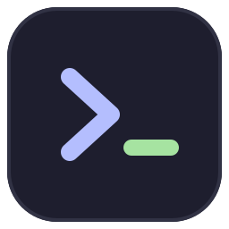
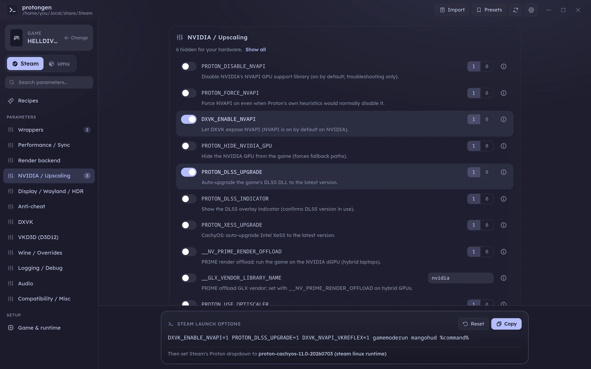
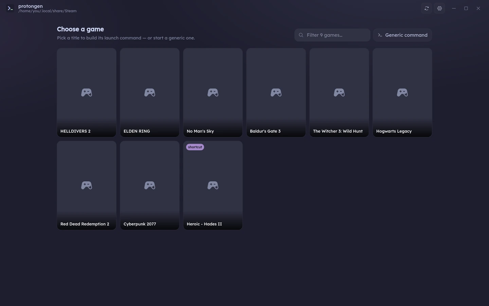
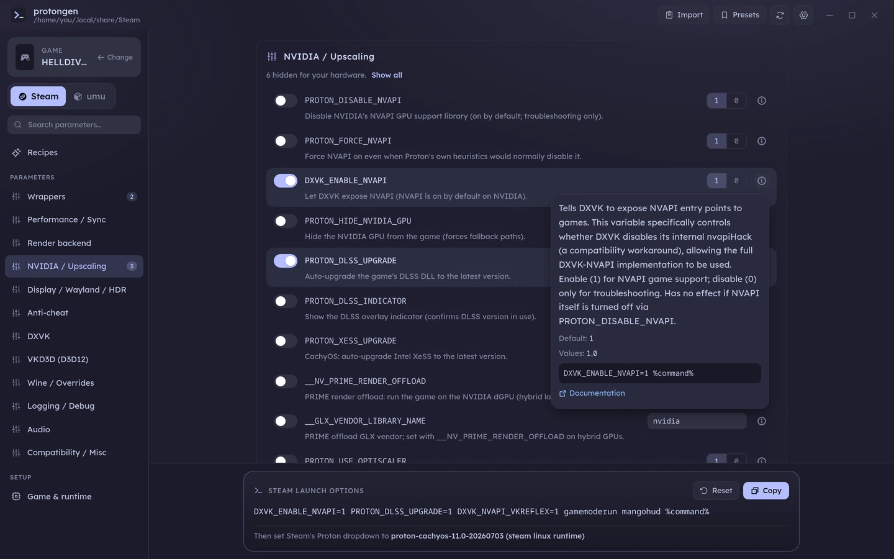
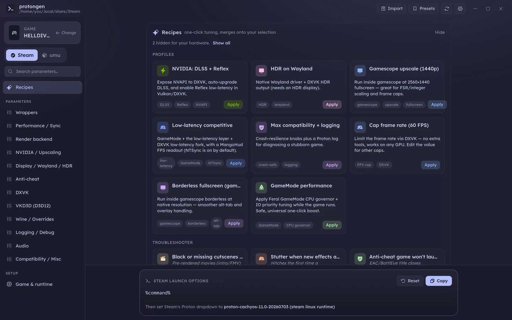
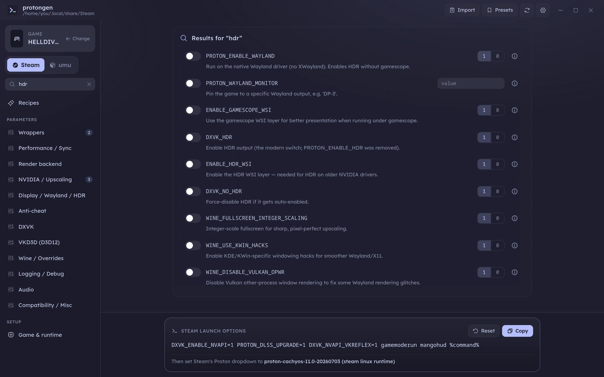
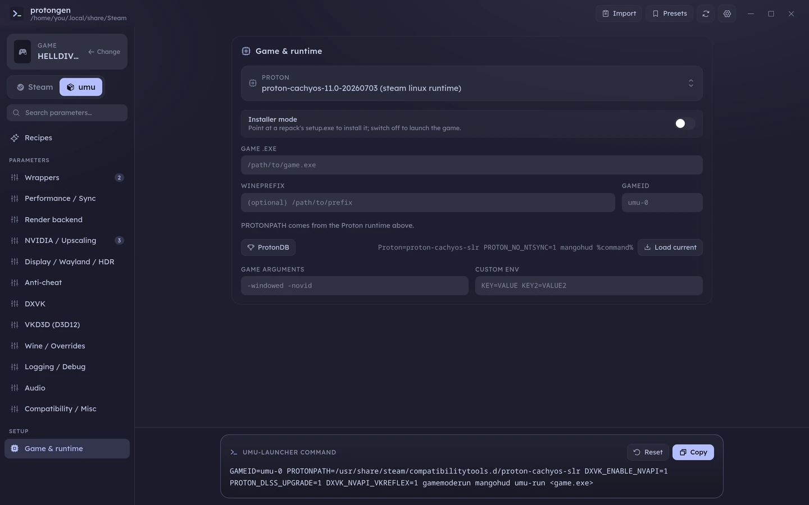
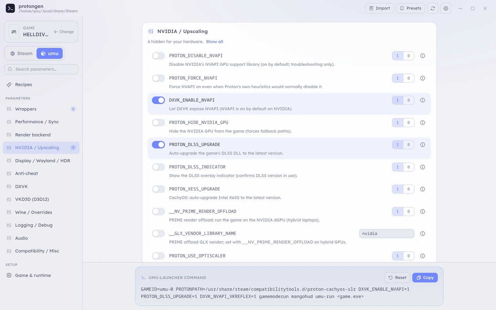
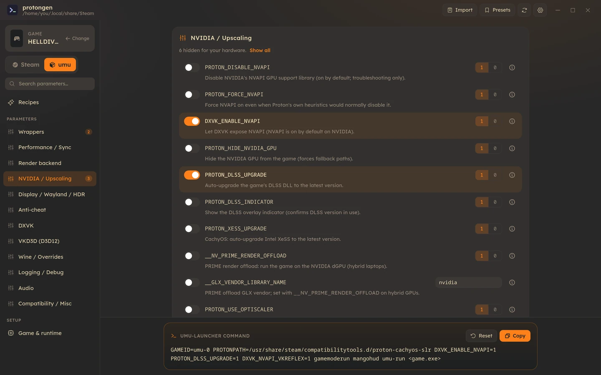
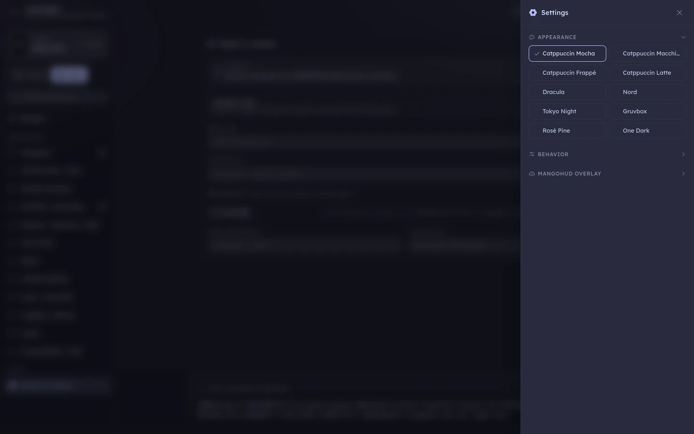

<div align="center">



# protongen

**Build Proton launch commands without memorising environment variables.**

protongen scans your Proton runtimes, your Steam library and your non-Steam shortcuts, then
gives you a searchable, explained catalogue of every tuning knob — and writes the launch
command for you as you toggle things. For Steam, and for
[umu-launcher](https://github.com/Open-Wine-Components/umu-launcher) outside Steam.

[**Install**](#install) · [Quick tour](#a-quick-tour) · [How to use it](#how-to-use-it) ·
[Documentation](https://github.com/cyberpunk89/Proton-Gen/wiki) ·
[Releases](https://github.com/cyberpunk89/Proton-Gen/releases)




</div>

---

## The problem it solves

Getting a Windows game running well under Proton usually comes down to a handful of environment
variables and wrapper programs — `PROTON_ENABLE_WAYLAND=1`, `DXVK_HDR=1`, `gamemoderun`,
`gamescope -W 2560 -H 1440 --`. Which ones you need depends on your GPU, your session and the
game, and the knowledge is scattered across the Proton README, the proton-cachyos changelog, the
CachyOS wiki, DXVK/VKD3D docs and forum threads.

protongen puts all of it in one window:

- **84 environment variables and 3 wrappers**, in 11 categories — each with a plain-English
  explanation, its default, accepted values, an example and a link to the upstream docs.
- **17 one-click recipes** — 10 curated profiles and 7 symptom-based troubleshooter fixes.
- **Live command preview**, pinned to the bottom of the window. One click copies it.
- **Hardware-aware**: it detects your GPU vendor, Wayland, KDE and `/dev/ntsync`, and hides
  options that can't apply to you (always revealable with *Show all*).

### It never touches your Steam configuration

protongen **reads** your Steam files to find games, runtimes and shortcuts. It **never writes to
any of them**. The only output is a string of text — nothing changes until *you* paste it into
Steam yourself. The only files it writes are its own: settings in `~/.config/protongen/` and
downloaded cover art in `~/.cache/protongen/`.

## Install

### Option 1 — prebuilt binary

Each [release](https://github.com/cyberpunk89/Proton-Gen/releases) publishes a `protongen`
binary and a matching `protongen.sha256`.

```bash
curl -LO https://github.com/cyberpunk89/Proton-Gen/releases/latest/download/protongen
curl -LO https://github.com/cyberpunk89/Proton-Gen/releases/latest/download/protongen.sha256
sha256sum -c protongen.sha256
install -Dm755 protongen ~/.local/bin/protongen
```

The release binary is built inside an `archlinux:latest` container on purpose — it's dynamically
linked, so an Ubuntu build would hit soname mismatches against CachyOS's rolling libraries.

### Option 2 — build from source (adds a menu entry and icon)

Needs **Rust**, **pnpm** (npm works as a fallback) and the Tauri Linux dependencies. No sudo.

```bash
git clone https://github.com/cyberpunk89/Proton-Gen.git
cd Proton-Gen && ./install.sh
```

That installs three files: the binary to `~/.local/bin/protongen`, an icon to
`~/.local/share/icons/`, and a launcher to `~/.local/share/applications/` — so protongen shows
up in your app menu. `./uninstall.sh` removes all three and deliberately leaves your config
alone.

> [!WARNING]
> Don't build with `cargo build --release`. It produces a binary that starts to a blank window,
> because a plain cargo build leaves the app in development mode looking for a Vite dev server.
> Use `./install.sh` or `pnpm tauri build`.

### Requirements

- **Linux** — built and tested on CachyOS; any Arch-based distro should work.
- **A native Steam install** (`~/.local/share/Steam`, `~/.steam/steam` or `~/.steam/root`).
  Flatpak Steam is not supported.
- **`webkit2gtk-4.1`** — the app uses your system WebView instead of bundling a browser engine.

These are optional, and only needed for the features that use them. protongen checks your
`$PATH` and badges each option installed or missing, so you can see at a glance what you'd need:

| Package | Used for |
|---|---|
| `gamescope` | the gamescope wrapper |
| `gamemode` (`gamemoderun`) | the GameMode wrapper |
| `mangohud` | the MangoHud overlay |
| `umu-launcher` (`umu-run`) | umu mode |

### Updating

protongen updates itself. On launch it compares its own version against the latest GitHub
release; if there's a newer one, a banner offers to install it. The download is checksum-verified
against the published `.sha256` and aborted on mismatch, then the running executable is replaced
atomically — the new version takes effect next time you start the app. A failed check (offline,
rate-limited) is silently ignored.

## How to use it

1. **Pick a game** — or start a generic command.
2. **Toggle what you need** — from a category, a search, or a one-click recipe.
3. **Copy the command** and paste it into Steam → right-click the game → *Properties* →
   *Launch Options*. In umu mode, paste it into a terminal or a script instead.

If you already have launch options set, hit **Import**, paste the string, and protongen parses
it back into toggles so you can keep building from where you are.

## A quick tour

### Your library, discovered

Steam games across every library folder, plus non-Steam shortcuts. Cover art comes from your local
Steam library cache, with a CDN fallback — titles with neither get a placeholder tile, as below.
Or skip the library entirely and build a generic command.



### Every option explained

No bare env-var names. Every entry has an ⓘ popover with what it does, its default, its accepted
values, a copy-ready example and a link to the upstream documentation — enforced by a unit test,
so it's never empty.



### One-click recipes, and a troubleshooter

Ten curated profiles (DLSS + Reflex, HDR on Wayland, gamescope upscaling, GameMode, frame caps…)
and seven symptom-based fixes — *black cutscenes*, *stutter when new effects appear*, *anti-cheat
game won't launch*. Applying one merges onto your current selection; it never silently turns
things off.



### Search the whole catalogue

Search matches keys, descriptions and details across all 11 categories at once.



### Steam or umu

Steam mode emits a `%command%` string plus the Proton runtime to select in Steam's dropdown. umu
mode emits a complete `umu-run` invocation with `GAMEID`, `PROTONPATH`, an optional
`WINEPREFIX`, game arguments and an installer mode for repack setups — so you can run Windows
games with Proton entirely outside Steam. Picking *GE-Proton (latest)* lets umu fetch and keep
the newest GE-Proton itself.



### Presets, per-game memory, and honest warnings

Save named presets, and protongen remembers what you used for each game so switching back
restores it. A notices strip flags conflicts before you paste — enabling gplasync in an
EAC/BattlEye title, HDR without Wayland or gamescope, two different DXVK forks at once.

### Ten themes

Catppuccin (all four flavours), Dracula, Nord, Tokyo Night, Gruvbox, Rosé Pine and One Dark.

| Catppuccin Latte | Gruvbox |
|---|---|
|  |  |

Plus opt-in capability toggles (HDR, FSR 4) for hardware that can't be auto-detected.



## Keeping the catalogue current

The parameter catalogue is plain TOML baked into the binary
([`params.toml`](src-tauri/params.toml), [`recipes.toml`](src-tauri/recipes.toml)) and records
which proton-cachyos build it was written against. When your installed build is newer, the app
tells you the catalogue may be stale. You can also drop your own copy of either file into
`~/.config/protongen/` to override the bundled one.

## Documentation

| Page | |
|---|---|
| [Home](https://github.com/cyberpunk89/Proton-Gen/wiki) | What it does and the read-only guarantee |
| [Installation](https://github.com/cyberpunk89/Proton-Gen/wiki/Installation) | Install, update, requirements, limitations |
| [Steam vs umu](https://github.com/cyberpunk89/Proton-Gen/wiki/Steam-vs-umu) | The two output modes, and running games outside Steam |
| [Recipes and troubleshooting](https://github.com/cyberpunk89/Proton-Gen/wiki/Recipes-and-troubleshooting) | One-click profiles, symptom-based fixes, greyed-out options |
| [Settings and files](https://github.com/cyberpunk89/Proton-Gen/wiki/Settings-and-files) | Presets, per-game memory, storage locations, privacy |
| [Glossary](https://github.com/cyberpunk89/Proton-Gen/wiki/Glossary) | `%command%`, umu, compat tools, prefixes |

Wiki pages are generated from [`docs/wiki/`](docs/wiki) — edit those, not the wiki.

## What protongen is not

- **Not a Proton installer or version manager.** It discovers runtimes you already have. The one
  exception is indirect: choosing *GE-Proton (latest)* in umu mode makes **umu** download it.
- **Not a Steam configuration tool.** It never writes Steam files; you paste the result.
- **Not Flatpak-aware.** Flatpak Steam is excluded by design.
- **Linux only.**

## Development

Built with **Tauri 2** — a Rust core behind a **Svelte 5 + TypeScript + Tailwind** UI. Command
assembly is a pure, unit-tested Rust function; the Tauri commands are just a serialization
bridge.

```bash
pnpm install
pnpm dev              # UI only, in a browser, with mock data
pnpm tauri dev        # the full app
pnpm check            # type-check the TS ↔ Rust contract
cd src-tauri && cargo test
cargo run -- --list   # discovery sanity check from the terminal
```

See [`design.md`](design.md) for the architecture and [`CLAUDE.md`](CLAUDE.md) for the
operational map.

## License

**[GNU GPL v3.0 or later](LICENSE)** — © 2026 the protongen authors.

You're free to use, study, share and modify protongen. If you distribute a modified version, it
has to stay free software under the same license, with source available. There's no warranty; see
the [license text](LICENSE) for the details.

The bundled [Lexend](https://www.lexend.com/) font is a separate work under the SIL Open Font
License 1.1 ([`public/fonts/OFL.txt`](public/fonts/OFL.txt)).

## Credits

Standing on the shoulders of [Proton](https://github.com/ValveSoftware/Proton),
[proton-cachyos](https://github.com/CachyOS/proton-cachyos),
[umu-launcher](https://github.com/Open-Wine-Components/umu-launcher),
[DXVK](https://github.com/doitsujin/dxvk),
[vkd3d-proton](https://github.com/HansKristian-Work/vkd3d-proton),
[gamescope](https://github.com/ValveSoftware/gamescope),
[GameMode](https://github.com/FeralInteractive/gamemode) and
[MangoHud](https://github.com/flightlessmango/MangoHud).
