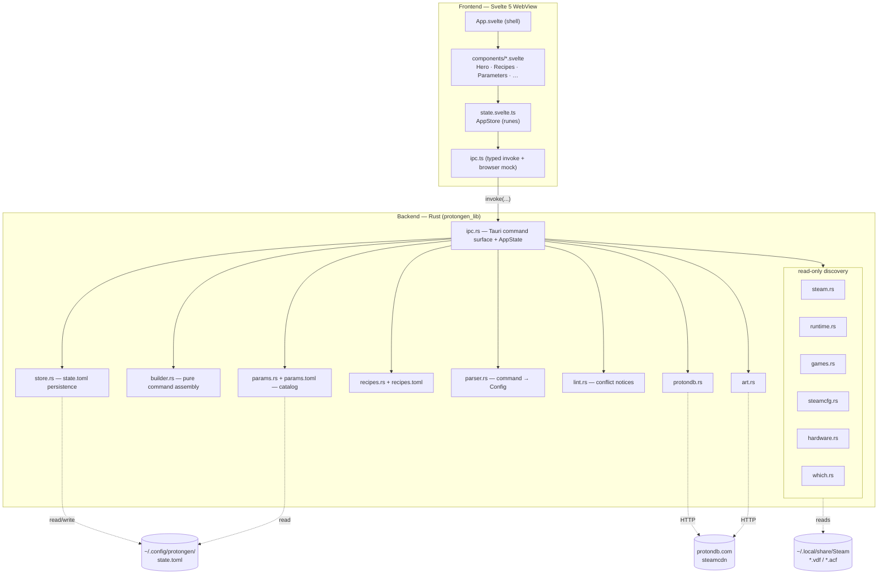

# protongen — Design Document

> A polished desktop app for building **Steam launch commands** and **umu-launcher
> commands** for Proton on CachyOS. It scans your installed Proton runtimes, Steam
> games and non-Steam shortcuts, lets you toggle a categorized, searchable catalog of
> env-vars / wrappers (badged installed/missing), and previews + copies the resulting
> launch command live.

This document describes *what* the project is, *how* it is structured, and *why* the
key decisions were made. It is the architectural companion to the user-facing
[`README.md`](README.md).

---

## 1. Purpose & scope

### 1.1 The problem

Running Windows games on Linux through Proton frequently requires a soup of
environment variables (`PROTON_ENABLE_WAYLAND=1`, `DXVK_NVAPI_VKREFLEX=1`, …), wrapper
programs (`gamescope`, `gamemoderun`, `mangohud`), and ordering rules that are easy to
get wrong. These get pasted into **Steam → game → Properties → Launch Options**, where
the magic token `%command%` marks where the game executable is substituted, or run
through **umu-launcher** for games outside Steam.

The knowledge of *which* variable does *what*, which ones conflict, and what order the
wrappers must nest in lives scattered across the Proton README, the proton-cachyos
changelog, the CachyOS wiki, DXVK/VKD3D docs, and tribal forum knowledge.

### 1.2 What protongen does

protongen turns that into a GUI:

- **Discovers** the local environment — Proton runtimes, installed games, non-Steam
  shortcuts, current per-game launch options/compat tools, GPU/session capabilities,
  and which wrapper binaries are on `$PATH`.
- **Presents** a data-driven, searchable catalog of parameters with per-parameter info
  popovers (what it does, default, accepted values, example, docs link).
- **Builds** the correct launch string live, with deterministic wrapper ordering and
  correct `--` / `%command%` placement.
- **Guides** the user with one-click recipes (profiles + a symptom→fix troubleshooter),
  hardware-aware relevance filtering, and conflict/footgun notices.
- **Remembers** per-game configuration and named presets, and can round-trip an
  existing command back into the UI by parsing it.

### 1.3 Design principles

1. **Read-only by contract.** protongen *never* writes to Steam config files. It
   reads `localconfig.vdf`, `config.vdf`, `appmanifest_*.acf`, `shortcuts.vdf`, and
   `compatibilitytool.vdf`, but its only output is a string you copy/paste yourself.
   Its own state lives entirely under `$XDG_CONFIG_HOME/protongen/`.
2. **Data-driven, not hardcoded.** The parameter catalog and recipes are TOML files,
   not Rust source. They can be refreshed (via the `/update-proton-params` skill) or
   overridden by the user without recompiling.
3. **Pure core, thin shell.** The command-assembly logic is a pure, unit-tested
   function. Tauri commands are a thin serialization bridge over pure modules.
4. **Graceful degradation.** Missing Steam install, unparseable config, absent
   hardware, offline network — every failure path falls back to a sensible default
   rather than crashing. Unknown ⇒ treated as relevant/available.
5. **Polish as a feature.** 10 themes, live preview, lazy game artwork, transitions,
   and a clean "advanced is hidden until needed" information hierarchy.

### 1.4 Non-goals

- Not a Proton installer or version manager (it discovers, it does not download/install
  runtimes).
- Not a Steam config writer (no automation of Launch Options — the user pastes).
- Not Flatpak-Steam aware — it deliberately targets the **native** Steam install.
- Not cross-platform in practice — it targets Linux/CachyOS desktops (Tauri could
  build elsewhere, but discovery and parameters are Linux-Proton specific).

---

## 2. Technology stack

| Layer | Choice | Why |
| --- | --- | --- |
| Shell / packaging | **Tauri 2** | Small binary, system WebView (no bundled Chromium), Rust backend with direct filesystem access, `.deb`/AppImage bundles. |
| Backend language | **Rust 2024 edition** | Safe, fast file parsing; the pure logic is trivially unit-testable. |
| Frontend framework | **Svelte 5** (runes) | Fine-grained reactivity with minimal boilerplate; `$state`/`$derived`/`$effect` map cleanly onto a single reactive store. |
| Language (FE) | **TypeScript** | DTOs mirror the Rust serde structs; `svelte-check` enforces the contract. |
| Styling | **Tailwind CSS 4** | Utility-first; theme palettes expressed as CSS custom properties mapped into Tailwind's `@theme`. |
| UI primitives | **bits-ui** | Headless, accessible popovers/dialogs/combobox primitives. |
| Icons | **phosphor-svelte** | Consistent icon set; recipe cards reference icons by name. |
| Build (FE) | **Vite 6** | Fast dev server (`localhost:1420`), HMR, production bundle into `../dist`. |
| HTTP (BE) | **ehttp** | Tiny blocking HTTP for ProtonDB + artwork CDN fallback. |
| VDF parsing | **keyvalues-parser** | Parses Valve's KeyValues format (comment-tolerant). |
| Steam discovery | **steamlocate 2** | Library folders, app manifests, shortcuts, compat-tool mapping. |
| Config format | **toml** | Human-editable catalog/recipes/state. |
| Serialization | **serde / serde_json** | The IPC contract and TOML/JSON (de)serialization. |

**Rust crate layout:** the package builds as both a binary (`protongen`, from
`main.rs`) and a library (`protongen_lib`, `crate-type = ["staticlib", "cdylib",
"rlib"]`) so Tauri's tooling and the `--list` CLI both consume the same `run()` /
`dump()` entry points.

---

## 3. High-level architecture

protongen is a classic **two-process Tauri app**: a Rust backend (the only side with
filesystem/network access) and a WebView frontend (Svelte). They communicate over
Tauri's typed `invoke` IPC. The frontend holds *selection* state; the backend holds
*discovery* state and does all *computation*.



### 3.1 Two key flows

**Bootstrap (once, at startup).** The frontend calls `bootstrap()`, which returns a
single `Bootstrap` struct containing *everything* the UI needs: the catalog, derived
categories, recipes, discovered runtimes/games, hardware facts, the persisted store,
current launch options/compat tools, the `requires` install-status map, and a possible
"catalog stale" banner. One round trip; the rest of discovery is already cached in
`AppState`.

**Live recompute (on every edit).** Whenever any builder input changes, a Svelte
`$effect` serializes the UI selection into a `Config` and (debounced ~60 ms) calls
`build_command()` and `lint()`. The command preview and notices update reactively. The
*assembly* is always done in Rust so the Tauri build and a unit test produce byte-
identical output.

---

## 4. Backend design (`src-tauri/src/`)

The backend is organized as a set of **pure logic modules** plus a thin **IPC bridge**.
`lib.rs` wires them together and exposes two entry points: `run()` (the Tauri app) and
`dump()` (the `--list` CLI). Almost every module carries its own `#[cfg(test)]` unit
tests.

### 4.1 `ipc.rs` — the command surface

The only module that knows about Tauri. Responsibilities:

- Defines **DTOs** (`RuntimeDto`, `GameDto`, `StaleInfo`, `Bootstrap`) — flattened,
  serializable projections of the internal types for the frontend.
- Holds **`AppState`**: immutable discovery results (catalog, recipes, hardware,
  runtimes, games, launch options, compat tools, `requires_status`, stale info) plus a
  `Mutex<Store>` for the one piece of mutable persisted state.
- `AppState::new()` runs *all* discovery once at startup (locate Steam → discover
  runtimes → list games → read launch options/compat tools → compute stale + requires
  status). A missing Steam install is captured as `load_error` rather than fatal.
- Exposes the commands (registered in `lib.rs`'s `invoke_handler!`):

| Command | Signature (→ return) | Purpose |
| --- | --- | --- |
| `bootstrap` | `() → Bootstrap` | One-shot startup payload. |
| `build_command` | `(Config, proton_path?) → String` | Assemble the Steam/umu command. |
| `parse_command` | `(input) → Config` | Inverse: import a pasted command. |
| `apply_recipe` | `(index, Config) → Config` | Merge a recipe onto the current config. |
| `lint` | `(Config) → Vec<String>` | Conflict / footgun notices. |
| `protondb_url` | `(appid) → String` | The community page URL. |
| `protondb_fetch` | `(appid) → Result<Tier>` | Tier summary (async, off-thread). |
| `game_art` | `(app_id, source, kind, online) → Option<String>` | Artwork as a `data:` URL (async). |
| `save_store` | `(Store) → ()` | Replace + persist the whole store. |

Network/IO-heavy commands (`protondb_fetch`, `game_art`) use
`tauri::async_runtime::spawn_blocking` so they never stall the UI thread.

The bridge also contains small translation helpers: `options_from_config` (rebuild
catalog `Options` from a `Config`'s lists), `parse_extra_env` (split the free-form
custom-env field), `compute_requires_status`, and `compute_stale`.

### 4.2 `builder.rs` — pure command assembly *(the core)*

This is the heart of the application and the most heavily tested module. It assembles
the launch string from `(env pairs, wrappers, game args)` with **deterministic
ordering**:

- A `Wrapper` enum: `Gamescope(args)` | `Gamemoderun` | `Mangohud`, each with a `rank()`
  (lower = more outer). Wrappers are **sorted by rank**, so output is identical
  regardless of the order the user toggled them.
- `gamescope` is always outermost and **owns the `--` separator** (`gamescope <args> --`)
  — it launches everything to its right.
- `env_and_wrappers()` is shared between the two builders so Steam and umu modes apply
  identical ordering rules.
- `build_command()` produces the Steam form: `ENV=v … <wrappers> %command% <game args>`,
  with `%command%` appearing **exactly once**.
- `build_umu_command()` produces the standalone form: optional `WINEPREFIX=`, then
  `GAMEID=` (defaults to `umu-0`), `PROTONPATH=`, then the user env + wrappers, then
  `umu-run "<exe>"` (shell-quoted only if it contains whitespace) + args.

Produced shape:
```
ENV1=v ENV2=v  gamescope <args> --  gamemoderun mangohud  %command%  <game args>
```

The module's tests pin every ordering rule (env-only, sorted wrappers, gamescope-wraps,
no-args gamescope, umu prefix order, exe quoting, "all combined", "%command% once").

### 4.3 `params.rs` + `params.toml` — the data-driven catalog

The catalog is the project's central data structure. `params.toml` (≈70 `[[env]]`
entries across categories + 3 `[[wrapper]]` entries) is the **single source of truth**;
`params.rs` loads and shapes it.

- **Load order:** `$XDG_CONFIG_HOME/protongen/params.toml` (user override) → the bundled
  copy baked in with `include_str!` (always works). A malformed override warns to stderr
  and falls back to bundled. This lets users customize without rebuilding, and lets the
  `/update-proton-params` skill refresh the bundled file without touching the override.
- **Types:** `WrapperDef` / `EnvDef` carry `key`, `category`, `default_value`, suggested
  `values`, an optional `requires` binary (drives the installed/missing badge), `help`,
  rich `details`/`example`/`url` (the ⓘ popover), and relevance hints `gpu`
  (`nvidia`/`amd`/`intel`) + `needs` (`wayland`/`kde`/`ntsync`).
- **`Options`** is the *live* UI state parallel to the catalog (per-entry
  `{enabled, value}`). `from_catalog()` initializes all-disabled-at-defaults.
- **`to_spec()`** translates enabled `Options` into `(env pairs, Wrapper list)` for the
  builder — the bridge between "what's toggled" and "what's built".
- `categories()` returns distinct env categories in first-seen order (drives the
  collapsible sections).
- A test asserts **every** catalog entry has full info (`details`/`example`/`url`), so
  the UI never shows a parameter without an explanation.

`Catalog::serialize` renames `wrapper`/`env` tables to `wrappers`/`envs` so the JSON the
frontend receives matches the TypeScript `Catalog` interface.

### 4.4 `recipes.rs` + `recipes.toml` — profiles & troubleshooter

Mirrors `params.rs` exactly (user-override → bundled, `include_str!`). 17 recipes of two
`kind`s:

- **`profile`** — curated starting points (NVIDIA DLSS+Reflex, AMD FSR4, HDR-on-Wayland,
  gamescope upscale, low-latency competitive, max-compatibility, …).
- **`fix`** — troubleshooter entries that map a `symptom` (black cutscenes, stutter,
  anti-cheat won't start, crash at launch, …) to the right options.

Each recipe carries presentation metadata (`icon`, `accent` hex, `tags`), relevance
hints (`gpu`, `needs`), and `env`/`wrappers` lists. `apply()` **merges** a recipe onto
the current `Options` — it enables and sets the listed keys but never disables anything
the user already turned on. Keys absent from the catalog (catalog drift) are appended to
the custom-env field instead of being lost.

### 4.5 `parser.rs` — command → `Config` (inverse of builder)

Lets a user paste an existing Steam Launch Options string *or* a `umu-run` command and
have the UI populate. Round-trips with the builder (tested).

- A small **quote-aware tokenizer** (`tokenize`) honors single/double quotes and strips
  them.
- Mode is detected by the presence of `umu-run` (vs. `%command%`); that token splits
  *pre* (env + wrappers) from *post* (game args, or exe + args in umu mode).
- `take_wrapper()` recognizes `gamemoderun`/`mangohud`/`gamescope` (collecting gamescope
  args up to `--`). `KEY=VALUE` tokens become env pairs, except `GAMEID`/`PROTONPATH`/
  `WINEPREFIX`, which are routed to umu-specific fields (`PROTONPATH` is ignored — it's
  derived from the runtime selection).

In `ipc::parse_command`, parsed env is split: catalog-known keys enable their toggles;
**unknown env lands in `extra_env`** via `store::unknown_env_string`.

### 4.6 Discovery subsystem (read-only)

| Module | Reads | Produces |
| --- | --- | --- |
| `steam.rs` | `~/.local/share/Steam`, `~/.steam/{steam,root}` (requires a real `libraryfolders.vdf`) | The native `SteamDir`; deliberately **ignores Flatpak**. |
| `runtime.rs` | `compatibilitytool.vdf` in system (`/usr/share/steam/compatibilitytools.d`) + user dirs, and Valve-bundled `steamapps/common/Proton*` | A sorted `Vec<Runtime>` (internal name, display name, `System`/`User`/`Bundled` kind, install path). |
| `games.rs` | App manifests across libraries + `shortcuts.vdf` (via steamlocate) | Sorted, de-duplicated games + non-Steam shortcuts, with runtime/redistributable apps filtered out (`HIDDEN_APP_IDS` + name heuristics). |
| `steamcfg.rs` | `userdata/*/config/localconfig.vdf` + the compat-tool mapping | `appid → current LaunchOptions` and `appid → mapped compat tool`. |

Notable details:
- Runtime VDF parsing is **comment-tolerant** (GE-Proton's template vdf contains `//`
  comments), and bundled Valve Proton folders are validated by the presence of
  `toolmanifest.vdf`.
- `installed_cachyos_build()` extracts the `YYYYMMDD` build date from the proton-cachyos
  runtime's display name (first 8-consecutive-digit run) — used for the staleness check.
- Non-Steam shortcuts surface their `executable`, which **prefills umu mode**.

### 4.7 `hardware.rs` — capability detection & relevance

Best-effort, never-blocking detection:

- **GPUs** via loaded kernel modules (`/sys/module/{nvidia,amdgpu,i915,xe}`) plus
  `nvidia-smi` on `$PATH`.
- **Session/desktop** via `XDG_SESSION_TYPE` / `WAYLAND_DISPLAY` / `XDG_CURRENT_DESKTOP`.
- **ntsync** via `/dev/ntsync` existence.

`irrelevance(gpu, needs)` returns a short reason ("needs NVIDIA GPU", "needs Wayland
session", …) when an option doesn't apply to this machine, or `None`. **Unknown is
treated as relevant** — detection never prevents toggling. The frontend uses this to
grey out / hide irrelevant options and recipes (controlled by the `show_irrelevant`
setting; `hdr` is an opt-in capability since it can't be auto-detected).

### 4.8 `lint.rs` — conflict / footgun notices

A pure function over `(catalog, enabled options, hardware)` returning human-readable
warnings. Encodes domain knowledge such as: NVAPI/DLSS enabled without an NVIDIA GPU;
`PROTON_FSR4_UPGRADE` needs RDNA4; `PROTON_USE_NTSYNC=1` without `/dev/ntsync`;
`wined3d` disabling DXVK options; obsolete `PROTON_ENABLE_HDR` alias; HDR without a
presentation path; gamescope + native Wayland conflict; gplasync vs. kernel anti-cheat;
mutually-exclusive DXVK forks. These surface in the **Notices** strip.

### 4.9 `store.rs` — persistence

`Store` (serialized to `$XDG_CONFIG_HOME/protongen/state.toml`) holds: chosen `theme`,
named `presets`, per-game `game_memory` (`appid → Config`), the dismissed staleness
build, and the `show_irrelevant` / `hdr` / `protondb_auto` toggles. `Config` is the
serializable snapshot of builder selection (umu flag, runtime, env/wrapper lists,
extra-env, umu fields, game args).

Helpers `options_to_lists` / `apply_lists` convert between the catalog's `Options` and
the flat key/value lists stored in a `Config` — and a test asserts the apply→capture
round-trip is stable. `unknown_env_string` extracts non-catalog env for the custom-env
field. All saves are best-effort (failures are swallowed; the app keeps working).

### 4.10 `protondb.rs` & `art.rs` — opt-in online features

- **`protondb.rs`** fetches the official *summary* endpoint (tier / confidence / score /
  report count — **no launch commands**) and exposes the community page URL. Opt-in via
  the `protondb_auto` setting.
- **`art.rs`** resolves game artwork (portrait/hero/header) with a strict priority:
  local Steam cache (`appcache/librarycache`, or per-user `config/grid` for non-Steam
  shortcuts) → previously downloaded cache (`$XDG_CACHE_HOME/protongen/art`) → optional
  Steam CDN fallback (Steam apps only, when `online`). Returns a base64 `data:` URL so
  the WebView needs no asset-protocol capability. Includes a hand-rolled base64 encoder
  (tested against the RFC vectors) to avoid a crate dependency for a few images.

### 4.11 `which.rs`

Minimal `$PATH` lookup (`is_installed`). Drives the green "installed" / red "missing"
badges via `compute_requires_status`, and feeds GPU detection.

---

## 5. Frontend design (`src/`)

A single-page Svelte 5 app. The shell (`App.svelte`) shows a spinner until `app.init()`
resolves, then renders `Header → StaleBanner → Hero → Notices → Recipes → Parameters`
inside a scrollable, centered column, plus a global `Toast`.

### 5.1 `state.svelte.ts` — the single source of truth

`AppStore` is one class instance (`export const app`) using Svelte 5 runes:

- **Bootstrap data** (`catalog`, `recipes`, `runtimes`, `games`, `hardware`,
  `requiresStatus`, `launchOptions`, `compatTools`, `stale`, `store`) — set once in
  `init()`.
- **Builder selection** (`umu`, `selectedRuntime`, `env`/`wrap` option maps, `extraEnv`,
  `gameArgs`, umu fields, `selectedAppId`/`selectedGameName`).
- **Derived/live** (`command`, `notices`) recomputed by a root `$effect` that serializes
  to a `Config` and calls the backend, **debounced ~60 ms** so rapid typing collapses
  into one round-trip.
- **Game art** is lazy, cached by `${source}:${appId}:${kind}` (undefined = not loaded,
  null = none found, string = data URL), de-duplicated via an `artRequested` set.

Key behaviors: `selectGame()` persists the outgoing game's config into `game_memory` and
restores the incoming game's remembered config (or resets), prefilling the umu exe for
shortcuts. `toConfig()`/`loadConfig()` are the symmetric serialize/deserialize against
catalog order. Presets, import, MangoHud, recipe application, theme, and settings all
funnel through here; `persistStore()` fires `save_store` fire-and-forget with
`$state.snapshot`.

### 5.2 `ipc.ts` — typed bridge + browser fallback

Wraps every Tauri command with a typed function. Crucially, it detects whether it's
running inside the Tauri WebView (`__TAURI_INTERNALS__`); when **not** (i.e. `pnpm dev`
in a plain browser) it returns **mock data** (`mock.ts`), so the entire UI can be
designed and iterated without launching the Rust backend.

### 5.3 `types.ts`

TypeScript interfaces that **mirror the serde DTOs** in `ipc.rs` one-to-one. This is the
hand-maintained contract between the two languages; `svelte-check` enforces it on the
frontend side.

### 5.4 Components (`src/lib/components/`)

| Area | Components | Role |
| --- | --- | --- |
| Shell | `Header`, `StaleBanner`, `Toast` | Top bar (import/save/settings), staleness banner, transient toasts. |
| Hero builder | `Hero`, `GamePicker`, `RuntimePicker`, `ModeToggle`, `UmuFields`, `CommandPreview`, `ProtonDbChip` | The searchable game picker, Proton dropdown, Steam⇄umu toggle, live copyable preview, ProtonDB chip. "Advanced" (runtime/args/custom-env) stays collapsed until needed or auto-opened in umu mode / when populated. |
| Discovery | `Recipes`, `Parameters`, `OptionRow`, `InfoPopover`, `Badges` | Recipe cards (profiles + troubleshooter), collapsible searchable parameter categories, per-row toggle/value with ⓘ popover and installed/missing badges. |
| Helpers | `MangoHud`, `SettingsDrawer`, `Notices`, `Switch`, `Dialog`, `Popover` | MangoHud config builder, settings drawer (theme/relevance/HDR/ProtonDB), conflict notices, primitives. |

### 5.5 Theming (`app.css` + `themes.ts`)

Design tokens are CSS custom properties (`--bg`, `--surface`, `--accent`, `--green`, …)
mapped into Tailwind's `@theme`. Ten palettes — Catppuccin (Mocha/Macchiato/Frappé/
Latte), Dracula, Nord, Tokyo Night, Gruvbox, Rosé Pine, One Dark — are defined as
`[data-theme="…"]` blocks. `applyTheme(id)` sets `documentElement.dataset.theme`; the
whole UI re-themes instantly and the choice persists in the store. Fonts are bundled
Lexend (self-hosted under `public/fonts`).

---

## 6. Data & contracts

### 6.1 The `Config` contract

`Config` (in `store.rs` / `types.ts`) is the shared currency between frontend and
backend, and the unit of persistence:

```
Config {
  umu: bool, runtime: Option<String>,
  env: Vec<(String,String)>, wrappers: Vec<(String,String)>,
  extra_env: String,
  umu_exe, umu_wineprefix, umu_gameid: String,
  game_args: String,
}
```

Three round-trips keep the system consistent and are all tested:
1. **Options ⇄ Config lists** — `apply_lists` / `options_to_lists`.
2. **Config → command → Config** — `builder` / `parser`.
3. **Store ⇄ TOML** — serde round-trip.

### 6.2 Persistence locations

| Path | Contents | Writer |
| --- | --- | --- |
| `$XDG_CONFIG_HOME/protongen/state.toml` | theme, presets, per-game memory, settings, dismissals | `store.rs` (only file protongen writes for state) |
| `$XDG_CONFIG_HOME/protongen/params.toml` | optional user catalog override | user / skill (read-only to app) |
| `$XDG_CONFIG_HOME/protongen/recipes.toml` | optional user recipes override | user (read-only to app) |
| `$XDG_CACHE_HOME/protongen/art/` | downloaded artwork cache | `art.rs` |

---

## 7. Build, run & distribution

- **Dev:** `pnpm tauri dev` runs Vite on `:1420` with HMR and launches the WebView
  pointed at it. `pnpm dev` alone runs the UI in a plain browser on mock data.
- **Production build:** `pnpm tauri build` runs `pnpm build` (svelte-check + Vite →
  `dist/`), embeds the frontend into the Rust binary, and produces `.deb` + AppImage
  bundles. A plain `cargo build --release` is **not** sufficient — it leaves the app in
  dev mode trying to reach `localhost:1420`.
- **User-level install:** `install.sh` builds with `tauri build --no-bundle` and installs
  the binary to `~/.local/bin`, an icon, and a `.desktop` launcher — no sudo. (It invokes
  the local Tauri CLI directly because pnpm forwards the extra `--`, which would leak
  `--no-bundle` into `cargo`.) `uninstall.sh` reverses it.
- **Verification CLI:** `protongen --list` (or `cargo run -- --list`) prints discovered
  Steam root, runtimes, hardware, games, and catalog size via `lib::dump()` — handy for
  scripting and CI sanity checks.
- **Capabilities:** the Tauri capability set is minimal — `core:default`, opener, and
  clipboard read/write text. Window is 1100×760 (min 820×560), dark theme.

---

## 8. Testing strategy

The architecture is deliberately shaped so the **valuable logic is pure and unit-tested
without a running app or a real Steam install**:

- `builder.rs` — every ordering/quoting/`%command%` rule (10 tests).
- `parser.rs` — Steam + umu round-trip, quoted values, no-arg gamescope.
- `params.rs` — bundled catalog parses, has entries, every entry has full info,
  categories ordered/unique, `to_spec` ordering.
- `recipes.rs` — both kinds present, every fix has a symptom, `apply` enables only listed
  keys.
- `store.rs` — TOML round-trip, options apply→capture stability.
- `steamcfg.rs`, `runtime.rs`, `art.rs`, `which.rs` — VDF parsing (with comments), build-
  date extraction, candidate path construction, base64 vectors.
- `lint.rs` — representative conflict rules fire/clear with hardware.

Discovery against the real filesystem and the WebView UI are validated manually / via
`--list`. The browser-mock path keeps frontend iteration decoupled from the backend.

---

## 9. Security & privacy posture

- **Read-only against Steam.** protongen never mutates Steam config; it only reads, and
  its sole instruction to the user is "paste this string yourself."
- **No telemetry.** The only outbound network calls are **opt-in**: ProtonDB tier
  summaries (compatibility stats only, no commands) and Steam-CDN artwork fallback. Both
  run off-thread and degrade silently when offline.
- **Least privilege.** Minimal Tauri capabilities; no shell execution, no arbitrary FS
  plugin. Artwork is delivered as in-memory `data:` URLs rather than exposing a file
  asset protocol.
- **Local-only state.** Everything persistent lives under the user's XDG dirs.

---

## 10. Extensibility & maintenance

- **Refreshing parameters.** Proton env-vars change every release. The bundled
  `/update-proton-params` Claude Code skill fetches upstream docs (Proton README,
  proton-cachyos changelog/README, CachyOS wiki, vkd3d-proton, DXVK), diffs them against
  `params.toml`, and adds/updates entries plus the `[meta]` build/date — without touching
  the user's `$XDG_CONFIG_HOME` override. The `[meta].proton_cachyos_build` drives the
  in-app "catalog stale" banner (compared against the installed runtime's date). Invoke it
  from Claude Code as `/update-proton-params`; definition in
  `.claude/skills/update-proton-params/SKILL.md`.
- **The user wiki** is generated from `docs/wiki/` — `scripts/sync-wiki.sh` mirrors it into
  the GitHub wiki, and `.github/workflows/wiki.yml` runs that on every push to `main` that
  touches those files. Edit the repo copy, never the wiki in the browser.
- **Adding a parameter** is a TOML edit — no Rust change — as long as it's an env var or
  one of the three known wrappers. New *wrapper programs* require a `Wrapper` enum variant
  + `rank()` + `to_spec`/`parser` handling.
- **Adding a recipe** is a TOML edit in `recipes.toml`.
- **Adding a theme** is a `[data-theme]` palette block in `app.css` + an entry in
  `themes.ts`.
- **User overrides** of `params.toml` / `recipes.toml` let power users diverge from the
  bundled catalog without rebuilding.

---

## 11. Notable design decisions & trade-offs

| Decision | Rationale | Trade-off |
| --- | --- | --- |
| Pure Rust core, thin IPC | Determinism + unit testability; one assembly path for app/tests/CLI | Frontend must round-trip to the backend even for "obvious" string building. |
| Data-driven catalog (TOML + `include_str!`) | Update without recompiling; user override; skill-refreshable | Hand-maintained TS↔Rust DTO mirror; bundled file must be kept current. |
| Single `bootstrap()` payload | One round-trip; discovery cached in `AppState` | Startup does all discovery eagerly (acceptable: it's fast and read-only). |
| Read-only / paste-yourself | Safety, trust, no risk of corrupting Steam config | Slightly less convenient than auto-applying. |
| Native Steam only (no Flatpak) | Predictable paths; CachyOS target | Flatpak Steam users unsupported by design. |
| `data:` URL artwork + hand-rolled base64 | No asset-protocol capability; one fewer crate | Larger IPC payloads for images (mitigated by lazy load + cache). |
| Debounced live recompute | Smooth typing, fewer IPC calls | ~60 ms latency between edit and preview. |
| Svelte 5 runes single store | Minimal boilerplate, fine-grained reactivity | All state centralized in one class (intentional). |

---

## 12. Directory map

```
Proton-gui/
├── README.md                  user-facing overview
├── design.md                  this document
├── install.sh / uninstall.sh  user-level desktop install (no sudo)
├── index.html · vite.config.ts · svelte.config.js · tsconfig.json
├── package.json               FE deps + scripts (dev/build/check/tauri)
├── public/fonts/              self-hosted Lexend
├── assets/ · public/logo.svg  branding
├── src/                       FRONTEND (Svelte 5 + TS + Tailwind)
│   ├── App.svelte · main.ts · app.css (tokens + 10 themes)
│   └── lib/
│       ├── state.svelte.ts    central reactive store (runes)
│       ├── ipc.ts · mock.ts   typed invoke + browser fallback
│       ├── types.ts           DTOs mirroring the Rust serde structs
│       ├── themes.ts · toast.svelte.ts · actions.ts · util.ts
│       └── components/*.svelte hero · recipes · parameters · dialogs · …
└── src-tauri/                 BACKEND (Rust / Tauri)
    ├── Cargo.toml · tauri.conf.json · build.rs
    ├── capabilities/default.json   minimal permission set
    ├── params.toml · recipes.toml  data-driven catalog + recipes
    ├── icons/
    └── src/
        ├── lib.rs              wiring: run() + dump(); registers commands
        ├── main.rs            binary entry (--list dump mode)
        ├── ipc.rs             Tauri command surface + AppState + DTOs
        ├── builder.rs         pure command assembly (Steam + umu)
        ├── params.rs          catalog load/override/to_spec
        ├── recipes.rs         profiles + troubleshooter
        ├── parser.rs          command → Config (inverse of builder)
        ├── lint.rs            conflict / footgun notices
        ├── store.rs           state.toml persistence + Config
        ├── steam.rs runtime.rs games.rs steamcfg.rs   read-only discovery
        ├── hardware.rs        GPU/session/ntsync detection + relevance
        ├── which.rs           $PATH lookup (installed/missing badges)
        ├── protondb.rs        opt-in tier summary
        └── art.rs             local→cache→CDN artwork as data: URLs
```

---

## 13. Glossary

- **`%command%`** — the placeholder Steam replaces with the game executable in Launch
  Options. Everything before it is env+wrappers; everything after is game args.
- **Proton** — Valve's compatibility layer (Wine + DXVK/VKD3D) for running Windows games
  on Linux. **proton-cachyos** is CachyOS's optimized build.
- **umu-launcher (`umu-run`)** — a standalone launcher to run Proton games *outside*
  Steam; needs `GAMEID` and `PROTONPATH`.
- **Wrapper** — a program placed before the target (`gamescope`, `gamemoderun`,
  `mangohud`); ordering and the `--` separator matter.
- **Compat tool / runtime** — an installed Proton version, discovered from
  `compatibilitytool.vdf` (custom) or `steamapps/common/Proton*` (Valve-bundled).
- **ProtonDB** — community site rating per-game Linux compatibility (Borked→Platinum).
- **VDF / ACF** — Valve's KeyValues text format used for Steam config and app manifests.
```
