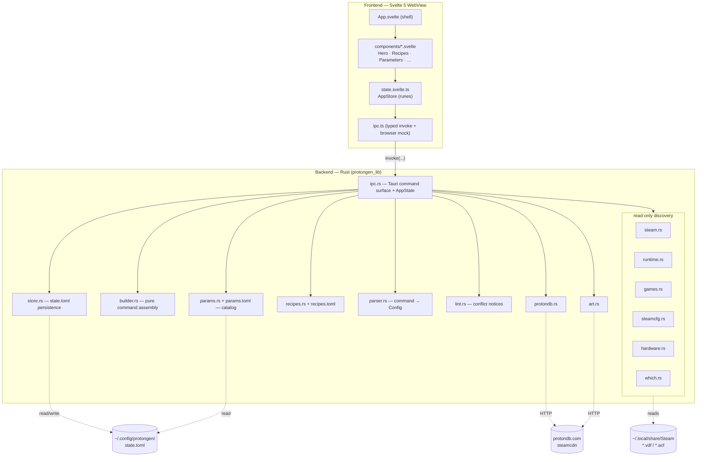

# protongen — Design Document

> A polished desktop app for building **Steam launch commands** and **umu-launcher
> commands** for Proton on CachyOS. It scans your installed Proton runtimes, Steam
> games and non-Steam shortcuts, lets you toggle a categorized, searchable catalog of
> env-vars / wrappers (badged installed/missing), and previews + copies the resulting
> launch command live.

This document describes *what* the project is, *how* it is structured, and *why* the
key decisions were made. It is the architectural companion to the user-facing
[`README.md`](README.md).

---

## 1. Purpose & scope

### 1.1 The problem

Running Windows games on Linux through Proton frequently requires a soup of
environment variables (`PROTON_ENABLE_WAYLAND=1`, `DXVK_NVAPI_VKREFLEX=1`, …), wrapper
programs (`gamescope`, `gamemoderun`, `mangohud`), and ordering rules that are easy to
get wrong. These get pasted into **Steam → game → Properties → Launch Options**, where
the magic token `%command%` marks where the game executable is substituted, or run
through **umu-launcher** for games outside Steam.

The knowledge of *which* variable does *what*, which ones conflict, and what order the
wrappers must nest in lives scattered across the Proton README, the proton-cachyos
changelog, the CachyOS wiki, DXVK/VKD3D docs, and tribal forum knowledge.

### 1.2 What protongen does

protongen turns that into a GUI:

- **Discovers** the local environment — Proton runtimes, installed games, non-Steam
  shortcuts, current per-game launch options/compat tools, GPU/session capabilities,
  and which wrapper binaries are on `$PATH`.
- **Presents** a data-driven, searchable catalog of parameters with per-parameter info
  popovers (what it does, default, accepted values, example, docs link).
- **Builds** the correct launch string live, with deterministic wrapper ordering and
  correct `--` / `%command%` placement.
- **Guides** the user with one-click recipes (profiles + a symptom→fix troubleshooter),
  hardware-aware relevance filtering, and conflict/footgun notices.
- **Remembers** per-game configuration and named presets, and can round-trip an
  existing command back into the UI by parsing it.

### 1.3 Design principles

1. **Read-only by contract.** protongen *never* writes to Steam config files. It
   reads `localconfig.vdf`, `config.vdf`, `appmanifest_*.acf`, `shortcuts.vdf`, and
   `compatibilitytool.vdf`, but its only output is a string you copy/paste yourself.
   Its own state lives entirely under `$XDG_CONFIG_HOME/protongen/`. The only
   writes outside it are the four named, confirm-gated exceptions in §11 (Heroic
   per-game config, OptiScaler fetch, MangoHud/vkBasalt system-wide export).
2. **Data-driven, not hardcoded.** The parameter catalog and recipes are TOML files,
   not Rust source. They can be refreshed (via the `/update-proton-params` skill) or
   overridden by the user without recompiling.
3. **Pure core, thin shell.** The command-assembly logic is a pure, unit-tested
   function. Tauri commands are a thin serialization bridge over pure modules.
4. **Graceful degradation.** Missing Steam install, unparseable config, absent
   hardware, offline network — every failure path falls back to a sensible default
   rather than crashing. Unknown ⇒ treated as relevant/available.
5. **Polish as a feature.** 10 themes, live preview, lazy game artwork, transitions,
   and a clean "advanced is hidden until needed" information hierarchy.

### 1.4 Non-goals

- Not a Proton installer or version manager (it discovers runtimes, it does not
  download/install them). Its only downloads are the app's own self-update
  (`update.rs`) and the confirm-gated OptiScaler fetch (§11). `runtime_updates.rs`
  only *tells* you a newer GE-Proton / proton-cachyos than the newest one installed
  is out (a dismissible banner, one GitHub query per used family per session);
  installing it stays yours.
- Not a Steam config writer (no automation of Launch Options — the user pastes).
- Not Flatpak-Steam aware — it deliberately targets the **native** Steam install.
- Not cross-platform in practice — it targets Linux/CachyOS desktops (Tauri could
  build elsewhere, but discovery and parameters are Linux-Proton specific).

---

## 2. Technology stack

| Layer | Choice | Why |
| --- | --- | --- |
| Shell / packaging | **Tauri 2** | Small binary, system WebView (no bundled Chromium), Rust backend with direct filesystem access, `.deb`/AppImage bundles. |
| Backend language | **Rust 2024 edition** | Safe, fast file parsing; the pure logic is trivially unit-testable. |
| Frontend framework | **Svelte 5** (runes) | Fine-grained reactivity with minimal boilerplate; `$state`/`$derived`/`$effect` map cleanly onto a single reactive store. |
| Language (FE) | **TypeScript** | DTOs mirror the Rust serde structs; `svelte-check` enforces the contract. |
| Styling | **Tailwind CSS 4** | Utility-first; theme palettes expressed as CSS custom properties mapped into Tailwind's `@theme`. |
| UI primitives | **bits-ui** | Headless, accessible popovers/dialogs/combobox primitives. |
| Icons | **phosphor-svelte** | Consistent icon set; recipe cards reference icons by name. |
| Build (FE) | **Vite 6** | Fast dev server (`localhost:1420`), HMR, production bundle into `../dist`. |
| HTTP (BE) | **ehttp** | Tiny blocking HTTP for ProtonDB + artwork CDN fallback. |
| VDF parsing | **keyvalues-parser** | Parses Valve's KeyValues format (comment-tolerant). |
| Steam discovery | **steamlocate 2** | Library folders, app manifests, shortcuts, compat-tool mapping. |
| Config format | **toml** | Human-editable catalog/recipes/state. |
| Serialization | **serde / serde_json** | The IPC contract and TOML/JSON (de)serialization. |

**Rust crate layout:** the package builds as both a binary (`protongen`, from
`main.rs`) and a library (`protongen_lib`, `crate-type = ["staticlib", "cdylib",
"rlib"]`) so Tauri's tooling and the `--list` CLI both consume the same `run()` /
`dump()` entry points.

---

## 3. High-level architecture

protongen is a classic **two-process Tauri app**: a Rust backend (the only side with
filesystem/network access) and a WebView frontend (Svelte). They communicate over
Tauri's typed `invoke` IPC. The frontend holds *selection* state; the backend holds
*discovery* state and does all *computation*.


```mermaid
flowchart TB
  subgraph FE["Frontend — Svelte 5 WebView"]
    App["App.svelte (shell)"]
    State["state.svelte.ts<br/>AppStore (runes)"]
    Comp["components/*.svelte<br/>Hero · Recipes · Parameters · …"]
    IpcTs["ipc.ts (typed invoke + browser mock)"]
    App --> Comp --> State
    State --> IpcTs
  end

  subgraph BE["Backend — Rust (protongen_lib)"]
    Ipc["ipc.rs — Tauri command surface + AppState"]
    Builder["builder.rs — pure command assembly"]
    Params["params.rs + params.toml — catalog"]
    Recipes["recipes.rs + recipes.toml"]
    Parser["parser.rs — command → Config"]
    Lint["lint.rs — conflict notices"]
    Store["store.rs — state.toml persistence"]
    subgraph Discover["read-only discovery"]
      Steam["steam.rs"]
      Runtime["runtime.rs"]
      Games["games.rs"]
      Steamcfg["steamcfg.rs"]
      Hardware["hardware.rs"]
      Which["which.rs"]
    end
    ProtonDB["protondb.rs"]
    Art["art.rs"]
  end

  IpcTs -- "invoke(...)" --> Ipc
  Ipc --> Builder & Params & Recipes & Parser & Lint & Store & Discover & ProtonDB & Art

  Discover -. reads .-> SteamFiles[("~/.local/share/Steam<br/>*.vdf / *.acf")]
  Store -. read/write .-> Cfg[("~/.config/protongen/<br/>state.toml")]
  Params -. read .-> Cfg
  ProtonDB & Art -. HTTP .-> Net[("protondb.com<br/>steamcdn")]
```

### 3.1 Two key flows

**Bootstrap (once, at startup).** The frontend calls `bootstrap()`, which returns a
single `Bootstrap` struct containing *everything* the UI needs: the catalog, derived
categories, recipes, discovered runtimes/games, hardware facts, the persisted store,
current launch options/compat tools, the `requires` install-status map, and a possible
"catalog stale" banner. One round trip; the rest of discovery is already cached in
`AppState`.

**Live recompute (on every edit).** Whenever any builder input changes, a Svelte
`$effect` serializes the UI selection into a `Config` and (debounced ~60 ms) calls
`recompute()`, which returns the command, its annotated tokens, the lint notices and the
Steam sync verdict in one round trip. The command preview and notices update reactively. The
*assembly* is always done in Rust so the Tauri build and a unit test produce byte-
identical output.

---

## 4. Backend design (`src-tauri/src/`)

The backend is organized as a set of **pure logic modules** plus a thin **IPC bridge**.
`lib.rs` wires them together and exposes two entry points: `run()` (the Tauri app) and
`dump()` (the `--list` CLI). Almost every module carries its own `#[cfg(test)]` unit
tests.

### 4.1 `ipc.rs` — the command surface

The only module that knows about Tauri. Responsibilities:

- Defines **DTOs** (`RuntimeDto`, `GameDto`, `StaleInfo`, `Bootstrap`) — flattened,
  serializable projections of the internal types for the frontend.
- Holds **`AppState`**: immutable discovery results (catalog, recipes, hardware,
  runtimes, games, launch options, compat tools, `requires_status`, stale info) plus a
  `Mutex<Store>` for the one piece of mutable persisted state.
- `AppState::new()` runs *all* discovery once at startup (locate Steam → discover
  runtimes → list games → read launch options/compat tools → compute stale + requires
  status). A missing Steam install is captured as `load_error` rather than fatal.
- Exposes the commands (registered in `lib.rs`'s `invoke_handler!`):

| Command | Signature (→ return) | Purpose |
| --- | --- | --- |
| `bootstrap` | `() → Bootstrap` | One-shot startup payload. |
| `recompute` | `(Config, proton_path?, app_id?, current?) → Recompute` | Command + tokens + lint notices + sync diff, one call per edit. |
| `parse_command` | `(input) → Config` | Inverse: import a pasted command. |
| `apply_recipe` | `(index, Config) → Config` | Merge a recipe onto the current config. |
| `protondb_url` | `(appid) → String` | The community page URL. |
| `protondb_fetch` | `(appid) → Result<Tier>` | Tier summary (async, off-thread). |
| `game_art` | `(app_id, source, kind, online) → Option<String>` | Artwork as a `data:` URL (async). |
| `save_store` | `(Store) → ()` | Replace + persist the whole store. |

Network/IO-heavy commands (`protondb_fetch`, `game_art`) use
`tauri::async_runtime::spawn_blocking` so they never stall the UI thread.

The bridge also contains small translation helpers: `options_from_config` (rebuild
catalog `Options` from a `Config`'s lists), `parse_extra_env` (split the free-form
custom-env field), `compute_requires_status`, and `compute_stale`.

### 4.2 `builder.rs` — pure command assembly *(the core)*

This is the heart of the application and the most heavily tested module. It assembles
the launch string from `(env pairs, wrappers, game args)` with **deterministic
ordering**:

- A `Wrapper` enum: `Gamescope(args)` | `GamePerformance` | `Gamemoderun` | `Mangohud` |
  `Plain(PlainWrapper)` (any other catalog wrapper, e.g. `prime-run`), each with a `rank()`
  (lower = more outer; a plain wrapper's comes from its catalog `order`). Wrappers are **sorted by rank**, so output is identical
  regardless of the order the user toggled them.
- `gamescope` is always outermost and **owns the `--` separator** (`gamescope <args> --`)
  — it launches everything to its right.
- `env_and_wrappers()` is shared between the two builders so Steam and umu modes apply
  identical ordering rules.
- `build_command()` produces the Steam form: `ENV=v … <wrappers> %command% <game args>`,
  with `%command%` appearing **exactly once**.
- `build_umu_command()` produces the standalone form: optional `WINEPREFIX=`, then
  `GAMEID=` (defaults to `umu-0`), `PROTONPATH=`, then the user env + wrappers, then
  `umu-run "<exe>"` (shell-quoted only if it contains whitespace) + args.

Produced shape:
```
ENV1=v ENV2=v  gamescope <args> --  gamemoderun mangohud  %command%  <game args>
```

The module's tests pin every ordering rule (env-only, sorted wrappers, gamescope-wraps,
no-args gamescope, umu prefix order, exe quoting, "all combined", "%command% once").

### 4.3 `params.rs` + `params.toml` — the data-driven catalog

The catalog is the project's central data structure. `params.toml` (≈70 `[[env]]`
entries across categories + 3 `[[wrapper]]` entries) is the **single source of truth**;
`params.rs` loads and shapes it.

- **Load order:** `$XDG_CONFIG_HOME/protongen/params.toml` (user override) → the bundled
  copy baked in with `include_str!` (always works). A malformed override warns to stderr
  and falls back to bundled. This lets users customize without rebuilding, and lets the
  `/update-proton-params` skill refresh the bundled file without touching the override.
- **Types:** `WrapperDef` / `EnvDef` carry `key`, `category`, `default_value`, suggested
  `values`, an optional `requires` binary (drives the installed/missing badge), `help`,
  rich `details`/`example`/`url` (the ⓘ popover), and relevance hints `gpu`
  (`nvidia`/`amd`/`intel`) + `needs` (`wayland`/`kde`/`ntsync`).
- **`Options`** is the *live* UI state parallel to the catalog (per-entry
  `{enabled, value}`). `from_catalog()` initializes all-disabled-at-defaults.
- **`to_spec()`** translates enabled `Options` into `(env pairs, Wrapper list)` for the
  builder — the bridge between "what's toggled" and "what's built".
- `categories()` returns distinct env categories in first-seen order (drives the
  collapsible sections).
- A test asserts **every** catalog entry has full info (`details`/`example`/`url`), so
  the UI never shows a parameter without an explanation.

`Catalog::serialize` renames `wrapper`/`env` tables to `wrappers`/`envs` so the JSON the
frontend receives matches the TypeScript `Catalog` interface.

### 4.4 `recipes.rs` + `recipes.toml` — profiles & troubleshooter

Mirrors `params.rs` exactly (user-override → bundled, `include_str!`). 17 recipes of two
`kind`s:

- **`profile`** — curated starting points (NVIDIA DLSS+Reflex, AMD FSR4, HDR-on-Wayland,
  gamescope upscale, low-latency competitive, max-compatibility, …).
- **`fix`** — troubleshooter entries that map a `symptom` (black cutscenes, stutter,
  anti-cheat won't start, crash at launch, …) to the right options.

Each recipe carries presentation metadata (`icon`, `accent` hex, `tags`), relevance
hints (`gpu`, `needs`), and `env`/`wrappers` lists. `apply()` **merges** a recipe onto
the current `Options` — it enables and sets the listed keys but never disables anything
the user already turned on. Keys absent from the catalog (catalog drift) are appended to
the custom-env field instead of being lost.

### 4.5 `parser.rs` — command → `Config` (inverse of builder)

Lets a user paste an existing Steam Launch Options string *or* a `umu-run` command and
have the UI populate. Round-trips with the builder (tested).

- A small **quote-aware tokenizer** (`tokenize`) honors single/double quotes and strips
  them.
- Mode is detected by the presence of `umu-run` (vs. `%command%`); that token splits
  *pre* (env + wrappers) from *post* (game args, or exe + args in umu mode).
- `take_wrapper()` recognizes `gamemoderun`/`mangohud`/`gamescope` (collecting gamescope
  args up to `--`). `KEY=VALUE` tokens become env pairs, except `GAMEID`/`PROTONPATH`/
  `WINEPREFIX`, which are routed to umu-specific fields (`PROTONPATH` is ignored — it's
  derived from the runtime selection).

In `ipc::parse_command`, parsed env is split: catalog-known keys enable their toggles;
**unknown env lands in `extra_env`** via `store::unknown_env_string`.

### 4.6 Discovery subsystem (read-only)

| Module | Reads | Produces |
| --- | --- | --- |
| `steam.rs` | `~/.local/share/Steam`, `~/.steam/{steam,root}` (requires a real `libraryfolders.vdf`) | The native `SteamDir`; deliberately **ignores Flatpak**. |
| `runtime.rs` | `compatibilitytool.vdf` in system (`/usr/share/steam/compatibilitytools.d`) + user dirs, and Valve-bundled `steamapps/common/Proton*` | A sorted `Vec<Runtime>` (internal name, display name, `System`/`User`/`Bundled` kind, install path). |
| `games.rs` | App manifests across libraries + `shortcuts.vdf` (via steamlocate) | Sorted, de-duplicated games + non-Steam shortcuts, with runtime/redistributable apps filtered out (`HIDDEN_APP_IDS` + name heuristics). |
| `steamcfg.rs` | `userdata/*/config/localconfig.vdf` + the compat-tool mapping | `appid → current LaunchOptions` and `appid → mapped compat tool`. |
| `nexus.rs` | `~/.local/share/nexus/games.json` (Nexus, the user's launcher; lenient — a bad entry is skipped, a missing file is an empty list) | One `GameSource::Nexus` entry per repack that **replaces** its Steam-shortcut and Heroic-sideload mirrors (`absorb`, matched by recorded id or same exe), keyed by the shortcut appid → Heroic hash → slug hash (what Nexus's own `protongen_id` resolves to), carrying its slug, prefix, pinned Proton and the absorbed ids (`alias_ids`) the frontend carries saved tuning over from. See §6.3. |
| `folders.rs` | A game's `compatdata/<id>/pfx` (or a Nexus game's own `pfx`) and `shadercache/<id>` | Their paths and sizes (symlinks not followed), for the Game & runtime panel; "Open" re-derives the path in Rust. |
| `logs.rs` | `steam-<id>.log` (Steam appid, or umu's game id) in `$HOME` or `PROTON_LOG_DIR`, Nexus's `<slug>-last-launch.log`, DXVK's `<exe>_<api>.log`, `VKD3D_LOG_FILE` | The candidate log sources for a game + its config, stat'ed, newest first; the viewer names a source id, never a path. |
| `lsfg.rs` | Vulkan `implicit_layer.d` manifests, `~/.config/lsfg-vk/conf.toml` (or `/etc/lsfg-vk/conf.toml`), Lossless Scaling's install folder (appid 993090, from `games.rs`) | `LsfgStatus`: whether the lsfg-vk 2.x layer is installed, the conf.toml profiles (for the `LSFGVK_PROFILE` pick list), and a `Lossless.dll` plus whether it's outside lsfg-vk's default search roots — per-game (`LSFGVK_ENV=1`) mode then needs `LSFGVK_DLL_PATH`. Read fresh on every `lsfg_status` call; profiles are edited in lsfg-vk's own `lsfg-vk-ui`, never here. |

Notable details:
- Runtime VDF parsing is **comment-tolerant** (GE-Proton's template vdf contains `//`
  comments), and bundled Valve Proton folders are validated by the presence of
  `toolmanifest.vdf`.
- `installed_cachyos_build()` extracts the `YYYYMMDD` build date from the proton-cachyos
  runtime's display name (first 8-consecutive-digit run) — used for the staleness check.
- Non-Steam shortcuts surface their `executable`, which **prefills umu mode**.

### 4.7 `hardware.rs` — capability detection & relevance

Also detects connected **monitors** (`/sys/class/drm/*/{status,modes,edid}`): the native
mode from `modes`, and the highest refresh at that mode from the EDID's detailed timings —
base block *and* CTA-861 extensions, since the base block often only lists 60 Hz. The
gamescope builder offers them as one-click output sizes.

Best-effort, never-blocking detection:

- **GPUs** via loaded kernel modules (`/sys/module/{nvidia,amdgpu,i915,xe}`) plus
  `nvidia-smi` on `$PATH`.
- **Session/desktop** via `XDG_SESSION_TYPE` / `WAYLAND_DISPLAY` / `XDG_CURRENT_DESKTOP`.
- **ntsync** via `/dev/ntsync` existence.
- **AMD RDNA generation** via the PCI id: `/sys/class/drm/card*/device/{vendor,device}`
  resolved against hwdata's `pci.ids` and bucketed by the `Navi <n>` codename. Every AMD
  card is tried and the first *recognised* generation wins, so an integrated Radeon
  (`Granite Ridge`, `Raphael` — no codename) doesn't mask the discrete card behind it.
  Surfaced as `gpu_gen_detected`, a **suggestion**: `store.gpu_gen` is the user's
  declaration and always outranks it. The two are reconciled in exactly two places, which
  must agree — `effectiveGpuGen` (`state.svelte.ts`) for the filter, and `ipc::lint` for
  the notices.

`hardware.rs` **detects only**. The filter itself — `irrelevance(hw, gpu, needs)` in
`src/lib/util.ts` — lives in the frontend and has no Rust mirror, because the opt-in
capabilities (`hdr`, and `fsr4`/`rdna3`/`rdna4` derived from `effectiveGpuGen`) are store
fields that never cross the IPC boundary. It returns a short reason
("needs NVIDIA GPU", "RDNA4-only", …) when an option doesn't apply, or `null`; the UI
greys out or hides those, controlled by `show_irrelevant`. **Unknown tags are treated as
relevant** so a user's `$XDG_CONFIG_HOME` override naming a future capability still
loads — the shipped TOMLs are instead held to `params::KNOWN_NEEDS` by a Rust test.

### 4.8 `lint.rs` — conflict / footgun notices

A pure function over `(catalog, enabled options, hardware, gpu_gen)` returning
human-readable warnings. Encodes domain knowledge such as: NVAPI/DLSS enabled without an
NVIDIA GPU; FSR 4 needing a declared AMD generation, with the RDNA3 MLFG workaround
offered as a one-click fix and flagged as a no-op on RDNA4; `PROTON_USE_NTSYNC=1`
without `/dev/ntsync`;
`wined3d` disabling DXVK options; obsolete `PROTON_ENABLE_HDR` alias; HDR without a
presentation path; gamescope + native Wayland conflict; gplasync vs. kernel anti-cheat;
mutually-exclusive DXVK forks. These surface in the **Notices** strip.

### 4.9 `store.rs` — persistence

`Store` (serialized to `$XDG_CONFIG_HOME/protongen/state.toml`) holds: chosen `theme`,
named `presets`, per-game `game_memory` (`appid → Config`), the dismissed staleness
build, the `show_irrelevant` / `hdr` / `protondb_auto` toggles, and a `paths` sub-struct
of user-supplied discovery overrides (extra Steam roots and libraries, extra Proton
directories, and per-program binary paths). `Config` is the serializable snapshot of
builder selection (umu flag, runtime, env/wrapper lists, extra-env, umu fields, game
args).

`options_from_lists` returns the env pairs the catalog has no entry for rather than
dropping them; callers re-home those into `extra_env` so a config written before a
catalog refresh keeps emitting its variables (#62).

Helpers `options_to_lists` / `apply_lists` convert between the catalog's `Options` and
the flat key/value lists stored in a `Config` — and a test asserts the apply→capture
round-trip is stable. `unknown_env_string` extracts non-catalog env for the custom-env
field. All saves are best-effort (failures are swallowed; the app keeps working).

### 4.10 `protondb.rs` & `art.rs` — opt-in online features

- **`protondb.rs`** fetches the official *summary* endpoint (tier / confidence / score /
  report count — **no launch commands**) and exposes the community page URL. Opt-in via
  the `protondb_auto` setting.
- **`art.rs`** resolves game artwork (portrait/hero/header) with a strict priority:
  local Steam cache (`appcache/librarycache`, or per-user `config/grid` for non-Steam
  shortcuts; a Heroic file hint; a Nexus game's artwork folder) → previously downloaded
  cache (`$XDG_CACHE_HOME/protongen/art`) → optional Steam CDN / Heroic URL fallback (when
  `online`). It returns the image **file**: `ipc::game_art` registers it under an opaque key
  (`<source>-<appid>-<kind>-<mtime>`) and the frontend loads `art://localhost/<key>`, served
  by an **asynchronous** custom protocol (`lib.rs`, `art::response`) on a worker thread with
  an immutable cache header. Not Tauri's asset protocol: that one is synchronous, so on Linux
  it read every tile's file on the UI thread, uncached — the 0.27.0 library stutter. Downloads are cached atomically under their real extension (by
  magic number — an HTML error page is never cached as art), with a 10 s timeout, and a
  remote 4xx is remembered for a week in a `.miss` sidecar.
- **`anticheat.rs`** — opt-in (`anticheat_check`): AreWeAntiCheatYet's community
  `games.json`, downloaded once, cached for three days (a failed refresh falls back to the
  stale copy), matched by Steam appid or normalized title.

### 4.11 `which.rs`

Minimal `$PATH` lookup (`is_installed`, `find`). Drives the green "installed" / red "missing"
badges via `compute_requires_status`, and feeds GPU detection.

### 4.12 `cli.rs` — the machine-readable command line

`protongen --list --json`, `--game-config <id> [--umu]` and `--catalog --json` print
versioned JSON (`"schema": 1`) from the same discovery, store and builder the app uses —
the contract Nexus reads instead of re-deriving protongen's schema in Python (§6.3).
`--list` without `--json` is the human dump (`lib::dump`). `--game <id>` is the GUI's:
with `tauri-plugin-single-instance`, running it again forwards the id to the open window
(`open-game` event) instead of starting a second one, and an id protongen doesn't know is
reported with a Rescan action rather than ignored.

### 4.13 `conf_merge.rs`

The shared core of the MangoHud.conf and vkBasalt.conf exports: merge a builder's lines
into a hand-editable flat config (managed keys replaced or cleared, everything else kept in
place), back up, write atomically. Each export only supplies its managed keys, its
line-splitting, and which extra keys it may replace. A test scans `mangohud.ts` /
`vkbasalt.ts` and fails if the TS builder can emit a key its Rust export doesn't own.

---

## 5. Frontend design (`src/`)

A single-page Svelte 5 app. The shell (`App.svelte`) shows a spinner until `app.init()`
resolves, then renders the `Header` over either the **Library** (cover-art grid) or the
**builder** — `NavRail` + `MainPanel` in Advanced mode, `SimplePanel` in Simple — with
`CommandPreview` pinned below. Every dialog (palette, builders, confirms, log viewer,
troubleshooter, compare) is mounted once at the root (the #63 rule, §11).

### 5.1 `state.svelte.ts` — the single source of truth

`AppStore` is one class instance (`export const app`) using Svelte 5 runes:

- **Bootstrap data** (`catalog`, `recipes`, `runtimes`, `games`, `hardware`,
  `requiresStatus`, `launchOptions`, `compatTools`, `stale`, `store`) — set once in
  `init()`.
- **Builder selection** (`umu`, `selectedRuntime`, `env`/`wrap` option maps, `extraEnv`,
  `gameArgs`, umu fields, `selectedAppId`/`selectedGameName`).
- **Derived/live** (`command`, `notices`) recomputed by a root `$effect` that serializes
  to a `Config` and calls the backend, **debounced ~60 ms** so rapid typing collapses
  into one round-trip.
- **Game art** (`art.svelte.ts`) and the **ProtonDB / anti-cheat lookups**
  (`lookups.svelte.ts`) live in their own rune modules — neither touches builder state.
  Art is lazy, concurrency-bounded and cached by `${source}:${appId}:${kind}` (undefined =
  not loaded, null = none found, string = `art:` URL).

Key behaviors: `selectGame()` persists the outgoing game's config into `game_memory` and
restores the incoming game's remembered config (or resets), prefilling the umu exe for
shortcuts. `toConfig()`/`loadConfig()` are the symmetric serialize/deserialize against
catalog order. Presets, import, MangoHud, recipe application, theme, and settings all
funnel through here; `persistStore()` fires `save_store` fire-and-forget with
`$state.snapshot`.

### 5.2 `ipc.ts` — typed bridge + browser fallback

Wraps every Tauri command with a typed function. Crucially, it detects whether it's
running inside the Tauri WebView (`__TAURI_INTERNALS__`); when **not** (i.e. `pnpm dev`
in a plain browser) it returns **mock data** (`mock.ts`), so the entire UI can be
designed and iterated without launching the Rust backend.

### 5.3 `types.ts`

TypeScript interfaces that **mirror the serde DTOs** in `ipc.rs` & co. They stay
hand-written (docs, and narrower types like `GpuGen` the Rust side can't express), but the
mirror is now **enforced**: each IPC struct derives `ts_rs::TS` under `cfg(test)` (ts-rs is a
dev-dependency only), `cargo test` writes their shapes to `src/lib/generated/`, and
`src/lib/contract.ts` makes `pnpm check` fail when an interface gains, loses or renames a
field, or an enum's string values differ. CI checks the generated files are committed fresh.

### 5.4 Components (`src/lib/components/`)

| Area | Components | Role |
| --- | --- | --- |
| Shell | `Header`, `UiModeToggle`, `PresetRow`, `NavRail`, `StaleBanner`, `UpdateBanner`, `Toast`, `ResizeGrips` | Top bar (back to library, preset picker, Simple⇄Advanced, import/save, log viewer, troubleshooter, rescan, settings, window controls), the Advanced-mode category rail, banners, transient toasts, CSD resize edges. |
| Library | `Library`, `GameTile` | Game grid (Steam, shortcuts, Heroic, Nexus) with local filters; picking a game or "Generic" enters the builder. *Select* mode applies one preset to many games (`applyPresetToGames`, one undo for all). |
| Builder | `MainPanel` (Advanced), `SimplePanel` (Simple), `GameRuntimePanel`, `CurrentGameCard`, `RuntimePicker` (type-to-filter Combobox), `ModeToggle`, `UmuFields`, `ProtonDbChip`, `AntiCheatNote`, `GameFolders`, `ActiveOptions` | Advanced = full categorised catalog; Simple = curated toggle grid over the same keys (a view, not a second store). Both share the game/runtime panel (Proton dropdown, Steam⇄umu toggle, umu fields, ProtonDB chip) and the "what's on" summary. |
| Command bar | `CommandPreview`, `CommandBody`, `LauncherAction`, `OpenInSteam`, `SyncPill` | Pinned live preview with Copy, tokenised/annotated via `explain.rs`; the one "get it into your launcher" slot (Open in Steam, or Heroic inject); Steam-sync status from `diff.rs`. |
| Discovery | `Recipes`, `RecipePreview`, `OptionRow`, `InfoPopover`, `Badges`, `CommandPalette` | Recipe cards (profiles + troubleshooter) with an apply preview, per-row toggle/value with ⓘ popover and installed/missing badges, Ctrl+K palette over games/parameters/recipes/presets/actions. |
| Builders & dialogs | `OverlayBuilders` (`MangoHud`, `VkBasalt`, `OptiScaler`, `LosslessScaling`, `GamescopeBuilder`, `DllOverrides`), `HeroicConfirm`, `NexusConfirm`, `CompareDialog`, `MangoHudSystemConfirm`, `VkBasaltSystemConfirm`, `LogViewer`, `Troubleshooter`, `Markdown`, `SettingsDrawer`, `DefaultProfilePrompt`, `IntroTour`, `ShortcutsSheet` | Root-mounted: overlay/OptiScaler/Lossless Scaling builders (MangoHud's string↔struct logic in `lib/mangohud.ts`; lsfg-vk's four modes — auto / profile / per-game / off — in `lib/lsfg.ts`, with an OptiScaler pairing panel that keeps OptiScaler to upscaling so frames aren't generated twice), the confirm dialogs gating every §11 write, Proton log viewer + LLM coach, AI troubleshooter, settings drawer (theme/relevance/HDR/GPU generation/paths/LLM/ProtonDB), first-run prompts. |
| Primitives | `Notices`, `Switch`, `Dialog`, `Popover` | Conflict notices and shared primitives. |

### 5.5 Theming (`app.css` + `themes.ts`)

Design tokens are CSS custom properties (`--bg`, `--surface`, `--accent`, `--green`, …)
mapped into Tailwind's `@theme`. Ten palettes — Catppuccin (Mocha/Macchiato/Frappé/
Latte), Dracula, Nord, Tokyo Night, Gruvbox, Rosé Pine, One Dark — are defined as
`[data-theme="…"]` blocks. `applyTheme(id)` sets `documentElement.dataset.theme`; the
whole UI re-themes instantly and the choice persists in the store. Fonts are bundled
Lexend (self-hosted under `public/fonts`).

---

## 6. Data & contracts

### 6.1 The `Config` contract

`Config` (in `store.rs` / `types.ts`) is the shared currency between frontend and
backend, and the unit of persistence:

```
Config {
  umu: bool, runtime: Option<String>,
  env: Vec<(String,String)>, wrappers: Vec<(String,String)>,
  extra_env: String,
  umu_exe, umu_wineprefix, umu_gameid: String,
  game_args: String,
}
```

Three round-trips keep the system consistent and are all tested:
1. **Options ⇄ Config lists** — `apply_lists` / `options_to_lists`.
2. **Config → command → Config** — `builder` / `parser`.
3. **Store ⇄ TOML** — serde round-trip.

### 6.2 Persistence locations

| Path | Contents | Writer |
| --- | --- | --- |
| `$XDG_CONFIG_HOME/protongen/state.toml` | theme, presets, per-game memory, settings, discovery paths, dismissals | `store.rs` (only file protongen writes for state) |
| `$XDG_CONFIG_HOME/protongen/params.toml` | optional user catalog override | user / skill (read-only to app) |
| `$XDG_CONFIG_HOME/protongen/recipes.toml` | optional user recipes override | user (read-only to app) |
| `$XDG_CACHE_HOME/protongen/art/` | downloaded artwork cache (+ `.miss` markers) | `art.rs` |
| `$XDG_CACHE_HOME/protongen/anticheat.json` | AreWeAntiCheatYet list, 3-day cache | `anticheat.rs` |

### 6.3 Nexus integration contract

Nexus (the user's own launcher, a separate Python/PyQt6 project) **launches**; protongen
**tunes**. protongen never launches a game. The coupling, in both directions:

| Direction | Mechanism |
| --- | --- |
| Nexus → protongen | `protongen --game <id>` ("Tune in protongen"; single-instance handoff); `protongen --list --json` / `--game-config <id>` / `--catalog --json` (`cli.rs`, `"schema": 1`) instead of reading `state.toml` and re-implementing the FNV id, share-code decoding and wrapper order. |
| protongen → Nexus (read) | `~/.local/share/nexus/games.json` (`nexus.rs`): one entry per repack, prefix + pinned Proton prefilled into umu mode, Nexus's `<slug>-last-launch.log` in the log viewer. |
| protongen → Nexus (write) | **Apply to Nexus**: `nexus-cli --set-launch <slug> protongen:v1:…` — the fifth §11 exception. |

Ids: a Nexus game keeps the id Nexus already passes (shortcut appid → Heroic hash), so
existing `game_memory` and favourites carry over; tuning saved under an absorbed mirror is
copied (not moved — Nexus still reads the old slots) to that id on load, preferring the
mirror Nexus's profile says it last imported from.

---

## 7. Build, run & distribution

- **Dev:** `pnpm tauri dev` runs Vite on `:1420` with HMR and launches the WebView
  pointed at it. `pnpm dev` alone runs the UI in a plain browser on mock data.
- **Production build:** `pnpm tauri build` runs `pnpm build` (svelte-check + Vite →
  `dist/`), embeds the frontend into the Rust binary, and produces `.deb` + AppImage
  bundles. A plain `cargo build --release` is **not** sufficient — it leaves the app in
  dev mode trying to reach `localhost:1420`.
- **User-level install:** `install.sh` builds with `tauri build --no-bundle` and installs
  the binary to `~/.local/bin`, an icon, and a `.desktop` launcher — no sudo. (It invokes
  the local Tauri CLI directly because pnpm forwards the extra `--`, which would leak
  `--no-bundle` into `cargo`.) `uninstall.sh` reverses it.
- **Verification CLI:** `protongen --list` (or `cargo run -- --list`) prints discovered
  Steam root, runtimes, hardware, games, and catalog size via `lib::dump()` — handy for
  scripting and CI sanity checks.
- **Capabilities:** the Tauri capability set is minimal — `core:default`, opener, and
  clipboard read/write text. Window is 1100×760 (min 820×560), dark theme.

---

## 8. Testing strategy

The architecture is deliberately shaped so the **valuable logic is pure and unit-tested
without a running app or a real Steam install**:

- **Rust** (`cd src-tauri && cargo test`, ~300 tests): builder ordering/quoting, parser
  round trips, catalog/recipes invariants, store round trips, lint rules, diff/explain,
  discovery parsers (VDF, Heroic, Nexus `games.json`, EDID), log-source selection, the
  config merges, OptiScaler extraction, the JSON CLI, and the `ipc` glue (via pure
  `*_with` helpers). One network test is `#[ignore]`d (`cargo test -- --ignored live_list`).
- **Frontend** (`pnpm test`, vitest): the pure modules — shell quoting, preset codes,
  MangoHud/vkBasalt/gamescope/DLL-override round trips, markdown safety, fuzzy, compare,
  util, and the browser mocks.
- **Shared fixtures**: `src-tauri/testdata/shell.json` drives both `builder::sh_quote` /
  `parser::tokenize` and their TS twins, so the two can't drift.
- **Contract**: `pnpm check` runs svelte-check (incl. `contract.ts`, §5.3) and the
  props-spread guard.
- **CI** (`.github/workflows/ci.yml`, every push/PR, same Arch container as releases):
  `pnpm check`, `pnpm test`, the frontend build, `cargo test --locked`, and a check that the
  generated bindings are committed.

Discovery against the real filesystem is validated with `--list`; the UI with the
browser-mock path (`pnpm dev`) and the Preview tools.

---

## 9. Security & privacy posture

- **Read-only against Steam.** protongen never mutates Steam config; it only reads, and
  its sole instruction to the user is "paste this string yourself."
- **No telemetry.** The outbound network calls are the **opt-in** ProtonDB tier
  summaries (compatibility stats only, no commands), the opt-in AreWeAntiCheatYet list,
  and Steam-CDN artwork fallback; the
  launch-time self-update check against GitHub Releases (`update.rs`); the confirm-gated
  OptiScaler fetch (§11); and — only once enabled in Settings — the local-LLM
  coach/troubleshooter (`llm.rs`), which sends the Proton log or symptom text, the built
  command and detected hardware to the user-configured endpoint. All run off-thread and
  degrade silently when offline.
- **Least privilege.** Minimal Tauri capabilities; no shell, no arbitrary FS plugin. The
  one process protongen starts is the user's own `nexus-cli`, for Apply to Nexus, with
  arguments passed straight to `execve` (no shell) and a slug taken from discovery. `decorations: false` means the client-side titlebar owns move, minimize,
  maximize, close *and* resize (`ResizeGrips.svelte`), so the window permission set is
  four narrow verbs rather than a general window capability. Art is served by a custom `art:` protocol that only answers keys `game_art` registered —
  no URL ever names a filesystem path, and Tauri's asset protocol stays off. "Open folder" re-derives its path in
  Rust and uses the opener's Rust API, so no filesystem-wide open-path capability exists.
- **Content-Security-Policy** (`tauri.conf.json`): `default-src 'self'`, images from
  self/`data:`/`art:`, IPC only for connections — a backstop behind `markdown.ts`'s
  no-`{@html}` rule for LLM output and release notes. `style-src` keeps `'unsafe-inline'`
  (Svelte styles) and is excluded from Tauri's nonce injection, which would disable it.
- **Local-only state.** Everything persistent lives under the user's XDG dirs.

---

## 10. Extensibility & maintenance

- **Refreshing parameters.** Proton env-vars change every release. The bundled
  `/update-proton-params` Claude Code skill fetches upstream docs (Proton README,
  proton-cachyos changelog/README, CachyOS wiki, vkd3d-proton, DXVK), diffs them against
  `params.toml`, and adds/updates entries plus the `[meta]` build/date — without touching
  the user's `$XDG_CONFIG_HOME` override. The `[meta].proton_cachyos_build` drives the
  in-app "catalog stale" banner (compared against the installed runtime's date). Invoke it
  from Claude Code as `/update-proton-params`; definition in
  `.claude/skills/update-proton-params/SKILL.md`.
- **The user wiki** is generated from `docs/wiki/` — `scripts/sync-wiki.sh` mirrors it into
  the GitHub wiki, and `.github/workflows/wiki.yml` runs that on every push to `main` that
  touches those files. Edit the repo copy, never the wiki in the browser.
- **Adding a parameter** is a TOML edit — no Rust change — for any env var and any
  argument-less wrapper program (set `order` to place it among the others). Only a
  wrapper that takes arguments, like gamescope, needs its own `Wrapper` variant.
- **Adding a recipe** is a TOML edit in `recipes.toml`.
- **Adding a theme** is a `[data-theme]` palette block in `app.css` + an entry in
  `themes.ts`.
- **User overrides** of `params.toml` / `recipes.toml` let power users diverge from the
  bundled catalog without rebuilding.
- **The OptiScaler-upgrade repos** are hardcoded in `optiscaler_upgrade.rs`'s
  `Channel::repo()`: stable → `optiscaler/OptiScaler` (`/releases/latest`),
  nightly → `optiscaler/OptiScaler-nightly` (newest entry of `/releases`, since
  every nightly is a prerelease and `/latest` 404s). Same pattern as
  `update.rs`'s own `REPO` for protongen's self-updater. If the project moves,
  update those; there's no override. The channel is a session-only choice in the
  confirm panel (starts on stable every launch), not a persisted store field.

---

## 11. Notable design decisions & trade-offs

| Decision | Rationale | Trade-off |
| --- | --- | --- |
| Pure Rust core, thin IPC | Determinism + unit testability; one assembly path for app/tests/CLI | Frontend must round-trip to the backend even for "obvious" string building. |
| Data-driven catalog (TOML + `include_str!`) | Update without recompiling; user override; skill-refreshable | Hand-maintained TS↔Rust DTO mirror; bundled file must be kept current. |
| Single `bootstrap()` payload | One round-trip; discovery cached in `AppState` | Startup does all discovery eagerly (acceptable: it's fast and read-only). |
| Read-only / paste-yourself | Safety, trust, no risk of corrupting Steam config | Slightly less convenient than auto-applying. |
| Native Steam only (no Flatpak) | Predictable paths; CachyOS target | Flatpak Steam users unsupported by design. |
| Artwork over an async `art:` protocol, by registered key | No base64 over IPC; read off the UI thread and cached by WebKit | One more protocol handler to keep honest: it must only serve keys `game_art` registered. |
| Debounced live recompute | Smooth typing, fewer IPC calls | ~60 ms latency between edit and preview. |
| Svelte 5 runes single store | Minimal boilerplate, fine-grained reactivity | All state centralized in one class (intentional). |
| OptiScaler-upgrade fetch writes into a game's folder | The one place read-only/paste-yourself has a named exception — see below | Introduces a network+filesystem write path that has to stay explicit-confirm-only forever, or the invariant is gone. |
| MangoHud system-wide export merges into a real config file outside `state.toml` | User-requested; follows the same backup-first, preserve-what-we-don't-own shape as the other two exceptions — see below | A third precedent-setting write path; the read-only invariant now rests on all three staying confirm-gated forever. |
| vkBasalt system-wide export merges into a real config file outside `state.toml` | Same shape again — vkBasalt has no inline env-var carrier at all, so this is its *only* apply path, not a second one alongside a command-apply button | A fourth precedent-setting write path; the read-only invariant now rests on all four staying confirm-gated forever. |
| Apply to Nexus runs `nexus-cli --set-launch` | Nexus keeps each repack's Steam shortcut and Heroic entry in step itself, so a direct Heroic write would be undone by its next apply — asking Nexus is the only write that sticks | A fifth exception, and the first that runs a program (the user's own launcher, never a shell); confirm-gated like the rest. |

**The OptiScaler-upgrade exception.** `optiscaler_upgrade.rs` fetches the
latest `optiscaler/OptiScaler` GitHub release (or, when the user picks the
nightly channel, the newest `optiscaler/OptiScaler-nightly` build) and extracts it into a *game's*
install directory — the only write outside `state.toml` besides
[`heroic::inject`]. Justified: the user explicitly asked for exactly this,
describing their own manual "grab the newest build, extract into the game
folder" workflow; `update.rs` already does the identical shape of thing for
the app's own binary; it only ever places files, never executes anything; and
every fetch is gated behind an explicit confirm dialog naming the exact
source, version and destination first. An existing `OptiScaler.ini` is never
overwritten (it may carry tuning applied through this app's own OptiScaler
builder), and the new `OptiScaler.dll` is written over the install's live
proxy (`dxgi.dll`, `winmm.dll`, … — verified to be OptiScaler by its strings)
rather than beside it, where nothing would load it. It only refreshes a
*manual* install: Proton's `PROTON_USE_OPTISCALER` injects from the prefix and
never writes the game folder, so the confirm step refuses while that is on. No checksum is published for OptiScaler's releases, unlike
protongen's own — integrity here rests on HTTPS plus fetching straight from
the project's own Releases API.

**The MangoHud system-wide export exception.** `mangohud_export.rs` merges the
overlay built in protongen's MangoHud dialog into the real, system-wide
`~/.config/MangoHud/MangoHud.conf` — the third write outside `state.toml`,
alongside [`heroic::inject`] and the OptiScaler fetch above. Justified the same
way: user-requested (so the overlay tuned here becomes the default for every
MangoHud-enabled program, not just the one launch command copied out of this
app); follows the Heroic exception's exact shape (back up first, preserve
every line it doesn't own, atomic write); and is never automatic — the
frontend only calls it from `MangoHudSystemConfirm`'s Apply handler, which
names the destination path and what's preserved before writing anything.
Unlike Heroic's structured JSON, `MangoHud.conf` is flat `key`/`key=value`
text, so "preserve what we don't own" means preserving every *line* whose key
isn't one the overlay builder can express — a hand-tuned font, a toggle
keybind, an app blacklist, unmodeled colors, comments — while the managed
keys are replaced wholesale to match the current build exactly, including
dropping a key the user has since unchecked (`ExportResult.cleared_keys`
reports these, so the confirm dialog and toast can name them).

**The Nexus apply exception.** `nexus::set_launch` runs `nexus-cli --set-launch <slug>
<code>` — the fifth action outside `state.toml`, and the mildest: protongen writes no file
itself; it asks the user's own launcher to do what its own `--set-launch` already does
(save the profile and re-apply it to launch.sh, the desktop entry and its Steam/Heroic
entries). Explicit-confirm only (`NexusConfirm`). The slug comes from discovery, never the
webview; the code must be share-code shaped (`protongen:v1:` + base64, ≤ 32 KiB); arguments
go straight to `execve`; a run is killed after a minute. Launching games stays out of scope
— that is Nexus's job.

**The vkBasalt system-wide export exception.** `vkbasalt_export.rs` merges the
effect chain built in protongen's vkBasalt dialog into the real, system-wide
`~/.config/vkBasalt/vkBasalt.conf` — the fourth write outside `state.toml`,
alongside [`heroic::inject`], the OptiScaler fetch and the MangoHud export
above. Same shape and same justification as the MangoHud exception: back up
first, preserve every line it doesn't own (a custom ReShade shader's own
config, `lutFile`, `deband*` tuning, comments), atomic write, never automatic
(only `VkBasaltSystemConfirm`'s Apply handler calls it). One difference from
MangoHud/OptiScaler: vkBasalt has no inline env-var carrier at all — its only
config surface is the real file — so this is the builder's *sole* apply
action rather than a system-wide option alongside a command-apply one. The
seed the dialog opens with is read straight from the live file (`vkbasalt_read_config`)
rather than derived from an env value, for the same reason.

---

## 12. Directory map

```
Proton-gui/
├── README.md                  user-facing overview
├── design.md                  this document
├── install.sh / uninstall.sh  user-level desktop install (no sudo)
├── index.html · vite.config.ts · svelte.config.js · tsconfig.json
├── package.json               FE deps + scripts (dev/build/check/tauri)
├── public/fonts/              self-hosted Lexend
├── assets/ · public/logo.svg  branding
├── src/                       FRONTEND (Svelte 5 + TS + Tailwind)
│   ├── App.svelte · main.ts · app.css (tokens + 10 themes)
│   └── lib/
│       ├── state.svelte.ts    central reactive store (runes)
│       ├── ipc.ts · mock.ts   typed invoke + browser fallback
│       ├── types.ts           DTOs mirroring the Rust serde structs
│       ├── themes.ts · toast.svelte.ts · actions.ts · util.ts
│       ├── art.svelte.ts · lookups.svelte.ts   art cache; ProtonDB/anti-cheat lookups
│       ├── contract.ts · generated/   types.ts ↔ Rust check (ts-rs output from cargo test)
│       ├── mangohud.ts        MANGOHUD_CONFIG parse/build (pure)
│       ├── gamescope.ts · dlloverrides.ts · compare.ts   builder/compare logic (pure)
│       ├── *.test.ts          vitest unit tests
│       ├── lsfg.ts            LSFGVK_* env ↔ Lossless Scaling builder state (pure)
│       └── components/*.svelte library · builder panels · command bar · dialogs · …
└── src-tauri/                 BACKEND (Rust / Tauri)
    ├── Cargo.toml · tauri.conf.json · build.rs
    ├── capabilities/default.json   minimal permission set
    ├── params.toml · recipes.toml  data-driven catalog + recipes
    ├── icons/
    └── src/
        ├── lib.rs              wiring: run() + dump(); registers commands
        ├── main.rs            binary entry (CLI routing → cli.rs, else the GUI)
        ├── cli.rs             --list/--game-config/--catalog JSON for scripts and Nexus
        ├── ipc.rs             Tauri command surface + AppState + DTOs
        ├── builder.rs         pure command assembly (Steam + umu)
        ├── compose.rs         Config → launch string pipeline (params::to_spec + builder)
        ├── explain.rs         byte-exact tokenizer for the annotated preview
        ├── diff.rs            built vs Steam-set command, compared as parsed normal forms
        ├── params.rs          catalog load/override/to_spec
        ├── recipes.rs         profiles + troubleshooter
        ├── parser.rs          command → Config (inverse of builder)
        ├── lint.rs            conflict / footgun notices
        ├── store.rs           state.toml persistence + Config
        ├── fsutil.rs          write_atomic / write_backup / read_existing (store, Heroic, exports)
        ├── steam.rs runtime.rs games.rs steamcfg.rs   read-only discovery
        ├── heroic.rs          Heroic game discovery + confirm-gated per-game config inject
        ├── nexus.rs           Nexus library discovery + confirm-gated nexus-cli --set-launch
        ├── logs.rs · folders.rs   log sources for the viewer; prefix/shader-cache sizes
        ├── conf_merge.rs      shared merge+write for the MangoHud/vkBasalt exports
        ├── anticheat.rs       opt-in AreWeAntiCheatYet lookup
        ├── lsfg.rs            lsfg-vk (Lossless Scaling FG) layer / profiles / DLL discovery
        ├── hardware.rs        GPU/session/ntsync detection + relevance
        ├── which.rs           $PATH lookup (installed/missing badges)
        ├── protondb.rs        opt-in tier summary
        ├── update.rs          self-update against GitHub Releases
        ├── optiscaler_upgrade.rs  fetch+extract latest OptiScaler into a game's folder
        ├── mangohud_export.rs merge the MangoHud builder into the system MangoHud.conf
        ├── vkbasalt_export.rs merge the vkBasalt builder into the system vkBasalt.conf
        ├── llm.rs             opt-in local-LLM log coach + troubleshooter (OpenAI-compatible)
        └── art.rs             local→cache→CDN artwork, served via the async `art:` protocol
```

---

## 13. Glossary

- **`%command%`** — the placeholder Steam replaces with the game executable in Launch
  Options. Everything before it is env+wrappers; everything after is game args.
- **Proton** — Valve's compatibility layer (Wine + DXVK/VKD3D) for running Windows games
  on Linux. **proton-cachyos** is CachyOS's optimized build.
- **umu-launcher (`umu-run`)** — a standalone launcher to run Proton games *outside*
  Steam; needs `GAMEID` and `PROTONPATH`.
- **Wrapper** — a program placed before the target (`gamescope`, `gamemoderun`,
  `mangohud`); ordering and the `--` separator matter.
- **Compat tool / runtime** — an installed Proton version, discovered from
  `compatibilitytool.vdf` (custom) or `steamapps/common/Proton*` (Valve-bundled).
- **ProtonDB** — community site rating per-game Linux compatibility (Borked→Platinum).
- **VDF / ACF** — Valve's KeyValues text format used for Steam config and app manifests.
```
